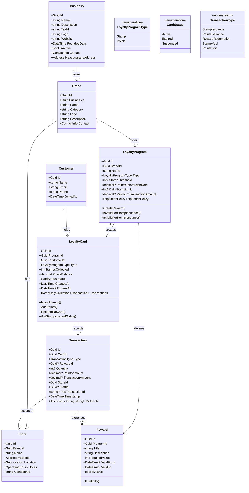
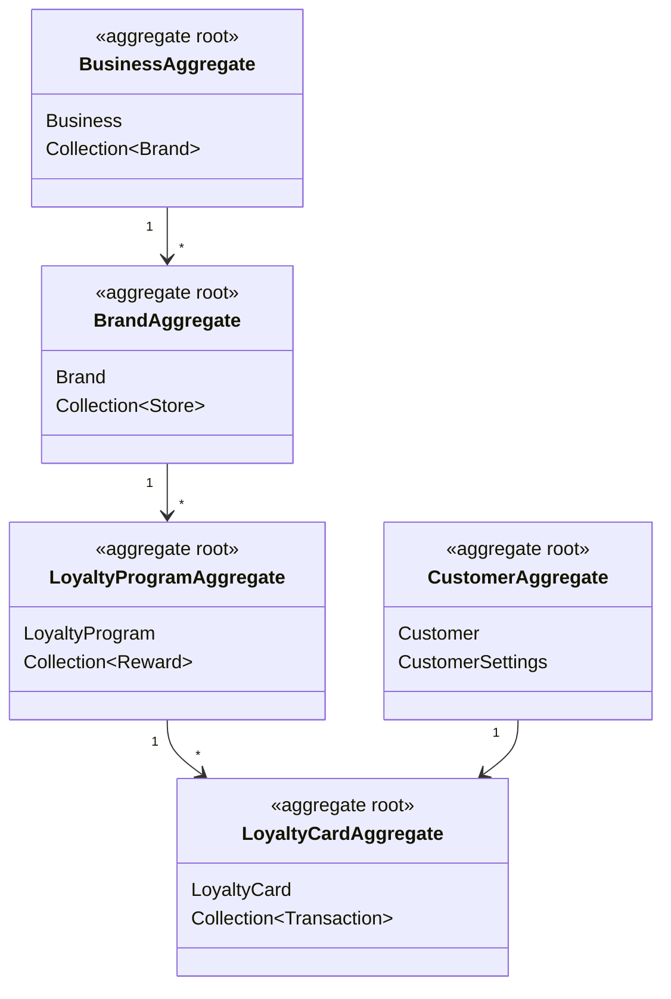
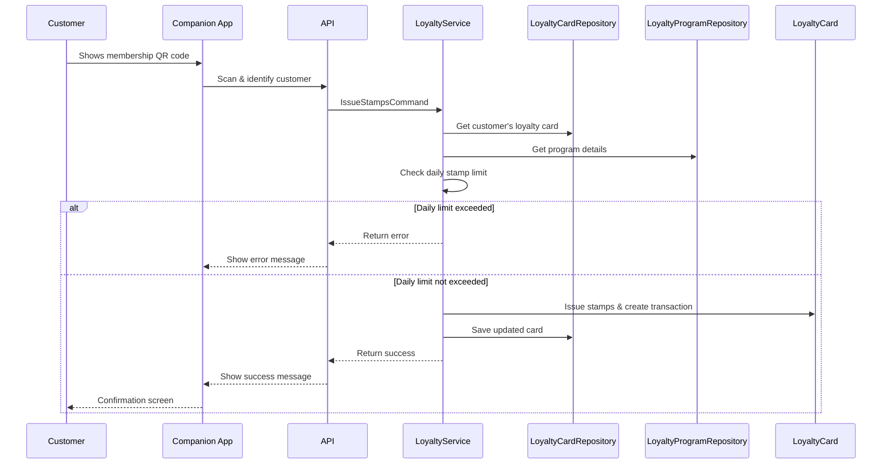
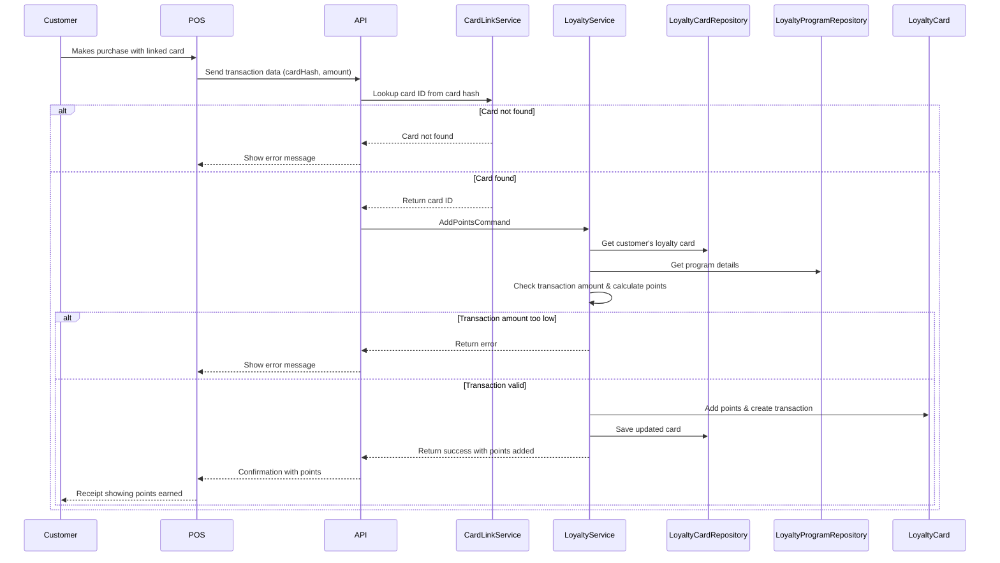
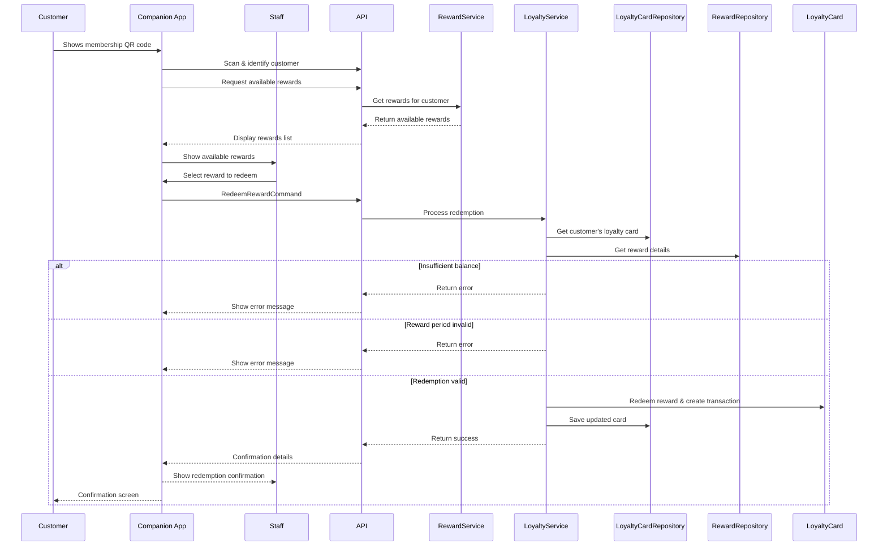
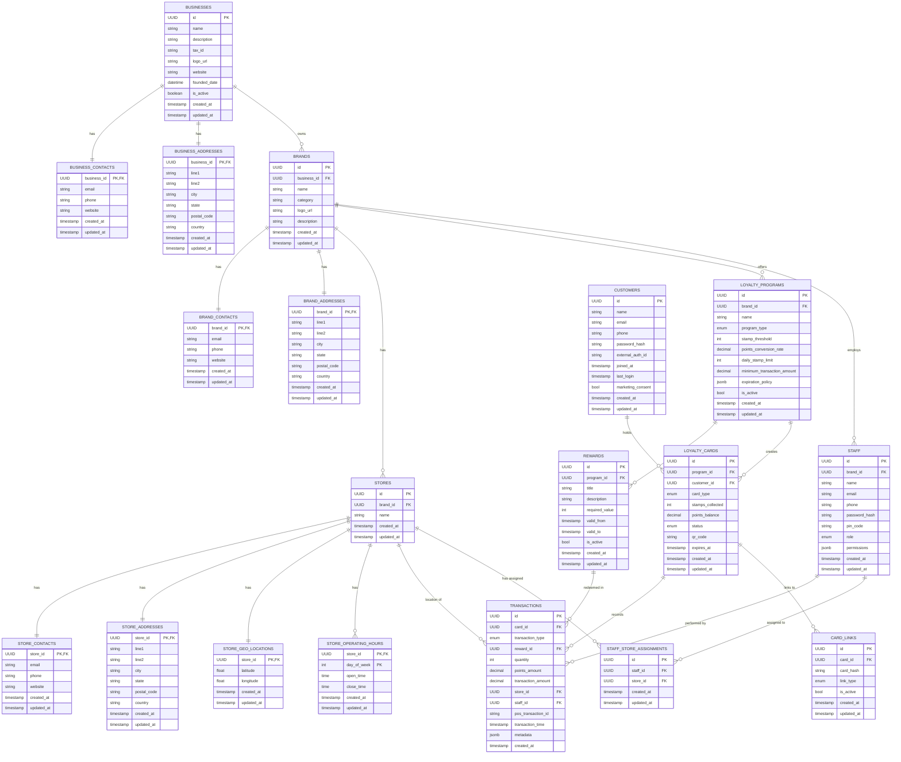

# Loyalty System: Domain Model Diagrams

This document contains various diagrams representing the domain model in Mermaid format.

## 1. Core Domain Model (Class Diagram)
[![](https://mermaid.ink/img/pako:eNqtV-tv4jgQ_1csf7oHi0pKtzRatWLLPji1tz2K9qQTX7zxANYlMWs7u81V7d9-4zgBJwSaeyCUOPPKzG8edh5pJDnQkEYx03oi2EqxZJES_BUU8jbTIgVcPDqq_f38IROcTLlH0UaJdEV-ZQnsUyegIyU2Rsh0nzlnD22WbuRK7lN_hy9aGP8VE2ZgLhIg72WWcuD22WN_kTImUz2OjPjm069lalhkpulSknLtccecKxvzR2D8a8aUAaVLmpN6crcaUIql_AWUCkqFaHf8rjGmlVR5V5Ta8T4Ycksw90Yq6BSMjbpDJBWiNRSdGZA3MmLWWVItPPanDSikpauPMlOYEXttQWgX28GYbmTOYpPfKWlr_P8Mrm55nm-A2IsnIVJzhaCyZDNfY_xrGftWOUQiYfEVuZMoqDGYb1hwiMOsXsyFlQkTcV6YuhGJMG1mbkUqkiyZo_saUUFD4wS7w5d997ARqsD6TsYiykmT4BeOAvRjBt-Z4j_86DGm-jOLBX8vVeHPVOuMpREckHHBNYUOJ-oaX9clSyXs-4zrTBuZgKpxOuXKpQoTEccQGWjJVZmqtyy2wfhgodeobTLbRPbWNqsconxsWphXLhWga9zpDEfRpzTOS58wT89efp-J96Br8OsMXDS1tGAfughq1BlwgKQl0x_AOCOFPT6XnOVHMug50yWDFrMa1dNvy5BVuiLOzZpe0SC_YX0ZYfLDDbbXDVv-sZYpXC0G414ERW8vly2jwr5Se1ZrItt6sBdt8fUzNxGFBlP5s7PVc7dncguGcWbYQfwdNP-2eaqNWZi482Zum2YGXzMsXI4Nn0FrZbtRoGRymDuXHXbvcqiMzZEarLr_vxxc3iU4bPfJd2uZtp5BfsHy2rX1i3tQUduee2_eQJol4Mbw5eWOcV-vDVfFhyPfjaAuxpvouvHjYXSf6Q3Ys1WXfv9nMVW7QTO2fboraTugkkbtFYY-S8GbRna0msvbE-2CDhaUvHp1iaufcOVOcCGR36sR6ihNOXc4CsmaHRVrnDfQ7nIJ1eGlwWzqlg0cEg5L62wnJX_fDElU7DF1zYLVVPOHdUgURFLxUm3bQ8dfZY8zpYZvzIk6pZN-f-DHpQCxAMzwC3oDD28ZRfYIyAztUXQKe5Pjh0tRawtq1oAdTENccqb-XNBF-oRyLDPyPk8jGhqVQY8qma3WNFyyWONTtsExCuVXz5YKXOAbb8vvInvr0Q1L_5AyqczgIw0f6QMNByej_unwdXA2GJ0Go-Hg7KJHcxqeDfsXwegkCC5OB8HpeTB86tG_CgOD_vB8FJwHg4sR_kdn56-f_gY9mA5L?type=png)](https://mermaid.live/edit#pako:eNqtV-tv4jgQ_1csf7oHi0pKtzRatWLLPji1tz2K9qQTX7zxANYlMWs7u81V7d9-4zgBJwSaeyCUOPPKzG8edh5pJDnQkEYx03oi2EqxZJES_BUU8jbTIgVcPDqq_f38IROcTLlH0UaJdEV-ZQnsUyegIyU2Rsh0nzlnD22WbuRK7lN_hy9aGP8VE2ZgLhIg72WWcuD22WN_kTImUz2OjPjm069lalhkpulSknLtccecKxvzR2D8a8aUAaVLmpN6crcaUIql_AWUCkqFaHf8rjGmlVR5V5Ta8T4Ycksw90Yq6BSMjbpDJBWiNRSdGZA3MmLWWVItPPanDSikpauPMlOYEXttQWgX28GYbmTOYpPfKWlr_P8Mrm55nm-A2IsnIVJzhaCyZDNfY_xrGftWOUQiYfEVuZMoqDGYb1hwiMOsXsyFlQkTcV6YuhGJMG1mbkUqkiyZo_saUUFD4wS7w5d997ARqsD6TsYiykmT4BeOAvRjBt-Z4j_86DGm-jOLBX8vVeHPVOuMpREckHHBNYUOJ-oaX9clSyXs-4zrTBuZgKpxOuXKpQoTEccQGWjJVZmqtyy2wfhgodeobTLbRPbWNqsconxsWphXLhWga9zpDEfRpzTOS58wT89efp-J96Br8OsMXDS1tGAfughq1BlwgKQl0x_AOCOFPT6XnOVHMug50yWDFrMa1dNvy5BVuiLOzZpe0SC_YX0ZYfLDDbbXDVv-sZYpXC0G414ERW8vly2jwr5Se1ZrItt6sBdt8fUzNxGFBlP5s7PVc7dncguGcWbYQfwdNP-2eaqNWZi482Zum2YGXzMsXI4Nn0FrZbtRoGRymDuXHXbvcqiMzZEarLr_vxxc3iU4bPfJd2uZtp5BfsHy2rX1i3tQUduee2_eQJol4Mbw5eWOcV-vDVfFhyPfjaAuxpvouvHjYXSf6Q3Ys1WXfv9nMVW7QTO2fboraTugkkbtFYY-S8GbRna0msvbE-2CDhaUvHp1iaufcOVOcCGR36sR6ihNOXc4CsmaHRVrnDfQ7nIJ1eGlwWzqlg0cEg5L62wnJX_fDElU7DF1zYLVVPOHdUgURFLxUm3bQ8dfZY8zpYZvzIk6pZN-f-DHpQCxAMzwC3oDD28ZRfYIyAztUXQKe5Pjh0tRawtq1oAdTENccqb-XNBF-oRyLDPyPk8jGhqVQY8qma3WNFyyWONTtsExCuVXz5YKXOAbb8vvInvr0Q1L_5AyqczgIw0f6QMNByej_unwdXA2GJ0Go-Hg7KJHcxqeDfsXwegkCC5OB8HpeTB86tG_CgOD_vB8FJwHg4sR_kdn56-f_gY9mA5L)

## 2. Aggregate Boundaries
[](https://mermaid.live/edit#pako:eNqdU91PgzAQ_1fIPRq2rIUNaJYlbj5qYpxPpi8NVEaEdmlLFBf82y1jH8FBdPal17v73e96HzuIZcKBQJwzre8ylipWUOHYs9c4y1Jngmt9m6aKp8xwZ9eamzOfs5NaSWkWi7PtCDxrVjLPeWwyKb6WionkqzXV7dUhbczXMzaoXrq1kYoP093LiuWmelSy-f3VvF14bwJP_J2p5NcMVtbpv_QNtpf72ZZFs1YeTGBVaiMLrq5mPwIvNWtuTCZS3cN5OVQUEAVnNFpY6cZK3Qk4oLpT8RMy0MUWO9TigSCdRrQRLiv0Fyy4YDEFyxK7Y_uSUjAbXnAKxIoJU28UqKitHyuNXFciBmJUyV1Qskw3QF5Zru2r3CY23GFBjy48yexkPxw2uLlc2DLxIuXJxT6B7OADCJqEY8-f4SkKPRz6aBq5UAGZ-uMIhxOMIw9hL8B-7cLnPgAa-0GIA4yiaOZNAi_w6m9t4k7C)

## 3. Key Workflows (Sequence Diagrams)

### 3.1 Stamp Issuance Workflow
[](https://mermaid.live/edit#pako:eNqNVE1v4jAQ_SsjH3YvWUQSKJBDpaqVVpW6UhduKy6uPYBVbKe2020W8d93ggMNH1WbQxJP3puZ98bxhgkrkRXM40uFRuCd4kvH9dwAXSV3QQlVchPgtvLBanQXvlhNT2XNTVkC9-9roMA5_Obx_jz4YGu-DvUM3asSeKEGd3KKpW3yt9h9yKtgXX1OeXS2UXLC6kQ_IjaJT-pEULzvjfhxfd1VXsBsZf960Kif0PmVKuH3FBp3W1oHS1RygRiCG_gGSqIJalGDOPKYIAQ8dqaAe-8rnAWuS08pNTdtc8e4prnWnwJ-Yjik_u5hHZEgDsLOuB2XIr2MAZAYuFr7D2invd6uUDyDJEYNvmkZ1kqr0HWT8HC3A-w-Ab4JRIltYxeq7L2bYqicAXTOundw49nFwUQgTcd7vmxHgmuPR8WN_UID0dl2EFGWpyEKhzwgBMeN5yJQ7U8yRHNn_BWhKiVxZWcinwv3lRAk5ivSW-ix-LM92XDbTUKTs2ahnOaNDvCkDVs5aCRLGGE0V5LOjU0TnrOwQo1zVtCr5O55zuZmSzheBTurjWBFcBUmzNlquWLFgpPzCYuy2xPnEEXZ_Je_4rG0O50SRl3-sVbv09CSFRv2xoq0P-7lg6tsmI7zbDxIh5OE1awYDnqTbNzPskmeZvkoG2wT9m-XIO0NRuNslKWTyVXeH-WjfPsfwrqwGA)

### 3.2 Points Addition via POS Integration
[](https://mermaid.live/edit#pako:eNqNVE1r4zAQ_StCh_0AtzR22iQ-BEoKu4WWLU1PSy6DNIlFbMkryclmS__7Spbd2vkoySHY43kz782T5pUyxZGm1OCfCiXDOwErDcVCEvcrQVvBRAnSklllrCpQH355-jU_DN4-3R-pAZo_CLmeo94IhocJD2oHud2d_O4LPGOpCJg2tw0ZYZXeHWGnlRe0h-pETwF94b0-ISn8t_O4mE7dAFLyCGs0pKw0y8Ag2QqbkdxpRU7YO9Rlunw3m5TMUXJiNUgDzAolCQcL5JvP_QkmiwgUqpL2ewA6iAPuzS913NS6KusG5P6OLLUqwovjkHXZOgVBkFSWLF3hhlCtpF_1omV4Kt9zaVXPM7UlqLXSpEBjYNWYhrmbQV3gzGbPaCstWyX9ZtNp_1yk5JbzJyWkNTNVFNCt389sZuZtTskPtIQ1rn01JA-ZHXeO4jsnJZQoQ4BwtCBy8wl0n_UsQ7bueR48Jl8ciZxVOVgkZa3ro-rHk_fw5RBslXJath95R7jsTbk2rA84x9R3Y7ssNpAL_mnz4EFtWqPOC9bo1XaGcUaNYMIcNkiq0t2X3t06T7qpGHOawv1s2ADnyE-PY6bkUugCarkdXB_hr7an2Rww35ChKC0xbppCrtpmCFp2u2F7et0DjaiDFiC428ivPrygNsMCFzR1jxz0ekEX8s3lQWXVfCcZTa2uMKJaVauMpktw_kQ0TKfZ5e9R5H7VPYaFX-_9iLpV91upoi3jXmn6Sv_SdHA1vkyGN_H1YJzE4-HgehLRHU2vh5eTeHwVx5NkECejePgW0X91gcHlcDSOR_FgMrlJrkbJKHn7D_pTD7s)

### 3.3 Reward Redemption
[](https://mermaid.live/edit#pako:eNq9VU1v2zAM_SuEDt0lLRo7bRIfChQtMBTYgC65DbmwFp0IsyVPktN5Rf_76K86iZPmthwcS3okxfeepTcRG0kiEo5-F6RjelS4tpitNPAvR-tVrHLUHh4K501G9siKyfhfGX2f54CuHwNPDOFLj0kynL5_fhpOLugVrVyS3aqYhsvfTImpL0-uP3DwgnJT7arFdlNOeWPLUxW7oH50Cl_lO0jfgJpnx9rl3d0uTREsN-bVQUbZC1m3UTn8WEAlRRu2g-VQ5oYjYtRwAUqS9iopId4T5FjEotLUecAtqhRfUgJb9-OaEMYwco_iCL6S71CQGHtQZQ982dfxhdWflRm0_6hcnmL5USpVzh9tpHZLQ9epAjVkSDClFHe9gDf8Jomyz9iq1psOeT1DLXd52vdaBM_WxORcnTbLPedq0Pu4alutgxpuOz6_cM8NEuIPzwxie__tKgOSPDPhdo3GcfCkXZEk7Ex2CLxgirr7KI4kPxCPrDW2Bx8VrRahBrJxncN1m51SR601ICerjASlt5gq-R-rdyrA54UbPTq1O0IvILaEnsBb1A7jXs4zki5xS1DkkmPljpDnO3ZFXNnnTM8PRifKZlg3tqf6wMUH30pvSz5W-iSng7uT6qCoY2KoDSMtxUgwJkMl-c54q6ZXwm8oo5WI-FWi_bUSK_3OOCy8WZY6FpG3BY2ENcV6I6IEWa-RaDhrb5uPWZLVMfu9uZLqm2kkeJc_jcm6NDwU0Zv4I6Lx9ewqnNwGN-NZGMwm45v5SJQiuplczYPZdRDMw3EQToPJ-0j8rROMrybTWTANxvP5bXg9Dafh-z9AlVuW)

## 4. Entity Relationship Diagram (Database Schema)
[![](https://mermaid.ink/img/pako:eNrdWVFv4jgQ_itRpH2jFaVsu-WNpbRXbQsVoTrtCSkyiQFvHTu1nba5tv_9xgkpJHaAu7Kn1fLSYnsmM998Hn8OL27AQ-x2XCzOCZoLFE2YA59Pn5weF9jpM0UUwTIf_XrnXQ36ntf3nJd8RH_u7q7OHRI6t99WY1IJwuYOQxE2BkMsA0FiRTgz5hR69kloDFM-534iqDHxhKeSqLVnhEhhRSLszHjCQhz6emA1PeWcYsQcIn0UKPK4NqWtpEJR7AQCg1HoI2WbTeKwNPuW_ykj5PeGg3G3NzaBmiaSMCylnyHWuDBBwxEiZqbxgjO8Pf_9ZtE9Px_Z6709DQrzR9bRljEaEJUagxCoMjOOOYxTX9PWdAM1VyLdNxqj7uB8K-MNVC523A4BPHnORbo76a0baH-pbuCuQCz8pYmbxb-BtZsT-G0o642Ho_6OlC0g2crX_UVWzzCp4NT5lRmWx1_PsC0J_F4M8y_7Q_962OuOr4aD3bGYUY6UQxFIi2Q94OU4Z_PKxB4jHt72RxDu4NL_Y3g32j1mwhRoi9TnM_8J4_vSPsr0Bo8x8_V_lfGAcoktEx_OByTaNU8RValzK7iWbhW1dj383r0ef_dvR8PLUfdm3-0AsyRy4vzJvkpjXAYry8BXC4HlgtM1SRfigESIAmdhmQTOskcsJJxlvihRO0ec0NTPXVESEWW6iQgjUQIRQOBSazpwhCLN-dXaH5KzqYOfYwKP0AtiTkmQlmXhT9OEo_6f3dGOAqLA014AqC7dUU9r9AR-SIiAsB4RTaxZwQQJ_ZngUf2s4v8TTvrOkcD-i7CoMLl3B5v3pj_60LXj35wdMZLyiYvQXyC5MD09KywY9FuUqEXpurLK9AewuxYGiqTyQd4RVoE2QuIeri9srreFxEztGeKiJfQ-SshsLlhWqzqZdYYAAXw1bUHvekpxAHHW9oUpoogF1X6jj79EGhV5EJWzb4VHtuuxrEHrY3Qdr3pOhbFjEKIeKBzruWjDOYPLhuN6XyvDmdkJ_GSx1Eg_JEiHlNYiXO2SxfSmTlo-Iw1GAGyzWU3zAo1SatL2fVNKt3Ro5k08wgpBUdAuxSyVS1Pev74afPvv9Xi_sBmNIasUqLj7Sol-dr_0NN4V6nnj7sXFns_6vbfQmLDKjs0gFJwaFY-xiIjUAkHuXRECUv5S0Xve1eXgpj8Y78YPK9Prd8e-Cv51-YLBGWGaSRm5ILH5du719eDg9dXyNqrjTFwoyMTdarK64my24S_FCxK9jj-x94WroDXPrBHnhsWjyy8fqo-1rK2PcbUY4lvehjeuMcRyls1sBtK0zqneZnoVjmLKUzNtTxPBlvYynmUqlRtxJUrb2tq0bYvLV7R6gwIn44ZUMam9fFgSNUBdPqhQxNp1iGea0YX7OpOyctGG-UYy43rXkJaAVkKy1q2-rFicQs_flGFuv3RaOvy1T4ED6IRGjiWjtfNJm-jDRDqgvd0NmmMzt2yRUB5kFg6fFZ6LYtQHH2Ic4RBExYo2mvt1BtCwZ1xoi2lq2RT6xLIGvuazrjNr93CukDlo6zVwqjSuNwYiO4WDies2XCAKHGqh23Gzrj9x1QKSnbgZNUGN60e8wTqQ-txLWeB2lEhwwxU8mS_czgxRCd_ytr38BeV9FIcEWsBN_gNL9jtLw40R-4vzqHADX93Oi_vsdg7a7fbhyefjz6fHzdbRyZeTL-2Gm8J4q9U8bJ62mm2Yap4120dvDffvzMXRYfv0S-u0dXR2dnLcPD0-PX77B1gVygc?type=png)](https://mermaid.live/edit#pako:eNrdWVFv4jgQ_itRpH2jFaVsu-WNpbRXbQsVoTrtCSkyiQFvHTu1nba5tv_9xgkpJHaAu7Kn1fLSYnsmM998Hn8OL27AQ-x2XCzOCZoLFE2YA59Pn5weF9jpM0UUwTIf_XrnXQ36ntf3nJd8RH_u7q7OHRI6t99WY1IJwuYOQxE2BkMsA0FiRTgz5hR69kloDFM-534iqDHxhKeSqLVnhEhhRSLszHjCQhz6emA1PeWcYsQcIn0UKPK4NqWtpEJR7AQCg1HoI2WbTeKwNPuW_ykj5PeGg3G3NzaBmiaSMCylnyHWuDBBwxEiZqbxgjO8Pf_9ZtE9Px_Z6709DQrzR9bRljEaEJUagxCoMjOOOYxTX9PWdAM1VyLdNxqj7uB8K-MNVC523A4BPHnORbo76a0baH-pbuCuQCz8pYmbxb-BtZsT-G0o642Ho_6OlC0g2crX_UVWzzCp4NT5lRmWx1_PsC0J_F4M8y_7Q_962OuOr4aD3bGYUY6UQxFIi2Q94OU4Z_PKxB4jHt72RxDu4NL_Y3g32j1mwhRoi9TnM_8J4_vSPsr0Bo8x8_V_lfGAcoktEx_OByTaNU8RValzK7iWbhW1dj383r0ef_dvR8PLUfdm3-0AsyRy4vzJvkpjXAYry8BXC4HlgtM1SRfigESIAmdhmQTOskcsJJxlvihRO0ec0NTPXVESEWW6iQgjUQIRQOBSazpwhCLN-dXaH5KzqYOfYwKP0AtiTkmQlmXhT9OEo_6f3dGOAqLA014AqC7dUU9r9AR-SIiAsB4RTaxZwQQJ_ZngUf2s4v8TTvrOkcD-i7CoMLl3B5v3pj_60LXj35wdMZLyiYvQXyC5MD09KywY9FuUqEXpurLK9AewuxYGiqTyQd4RVoE2QuIeri9srreFxEztGeKiJfQ-SshsLlhWqzqZdYYAAXw1bUHvekpxAHHW9oUpoogF1X6jj79EGhV5EJWzb4VHtuuxrEHrY3Qdr3pOhbFjEKIeKBzruWjDOYPLhuN6XyvDmdkJ_GSx1Eg_JEiHlNYiXO2SxfSmTlo-Iw1GAGyzWU3zAo1SatL2fVNKt3Ro5k08wgpBUdAuxSyVS1Pev74afPvv9Xi_sBmNIasUqLj7Sol-dr_0NN4V6nnj7sXFns_6vbfQmLDKjs0gFJwaFY-xiIjUAkHuXRECUv5S0Xve1eXgpj8Y78YPK9Prd8e-Cv51-YLBGWGaSRm5ILH5du719eDg9dXyNqrjTFwoyMTdarK64my24S_FCxK9jj-x94WroDXPrBHnhsWjyy8fqo-1rK2PcbUY4lvehjeuMcRyls1sBtK0zqneZnoVjmLKUzNtTxPBlvYynmUqlRtxJUrb2tq0bYvLV7R6gwIn44ZUMam9fFgSNUBdPqhQxNp1iGea0YX7OpOyctGG-UYy43rXkJaAVkKy1q2-rFicQs_flGFuv3RaOvy1T4ED6IRGjiWjtfNJm-jDRDqgvd0NmmMzt2yRUB5kFg6fFZ6LYtQHH2Ic4RBExYo2mvt1BtCwZ1xoi2lq2RT6xLIGvuazrjNr93CukDlo6zVwqjSuNwYiO4WDies2XCAKHGqh23Gzrj9x1QKSnbgZNUGN60e8wTqQ-txLWeB2lEhwwxU8mS_czgxRCd_ytr38BeV9FIcEWsBN_gNL9jtLw40R-4vzqHADX93Oi_vsdg7a7fbhyefjz6fHzdbRyZeTL-2Gm8J4q9U8bJ62mm2Yap4120dvDffvzMXRYfv0S-u0dXR2dnLcPD0-PX77B1gVygc)
