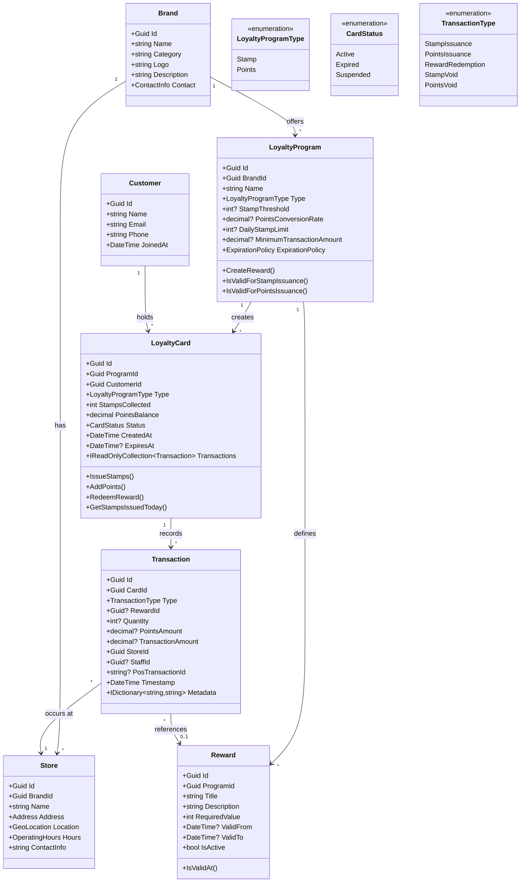
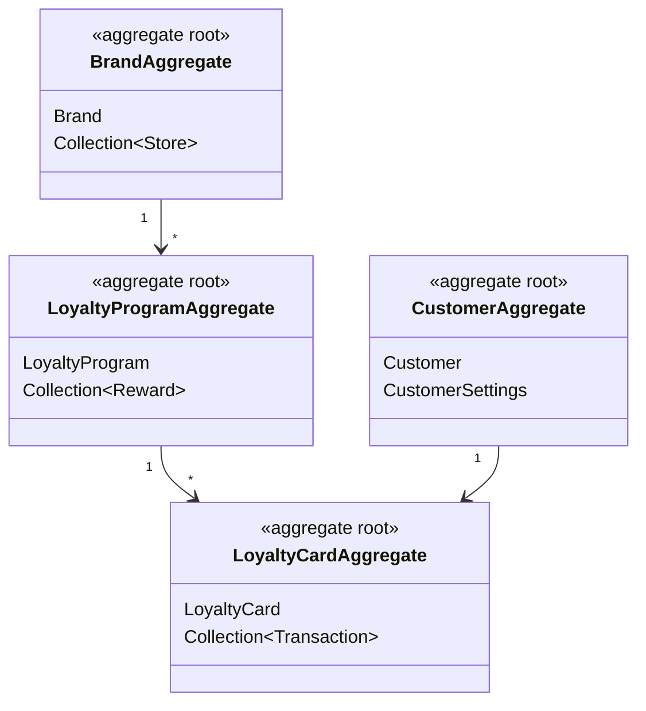
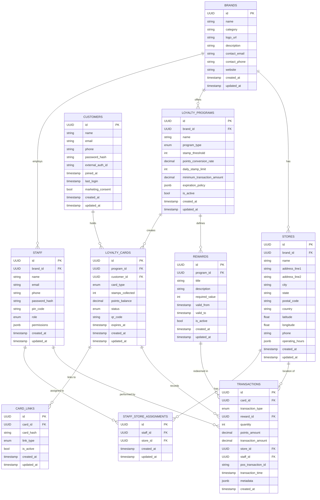

# Loyalty System: Domain Model Diagrams

This document contains various diagrams representing the domain model in Mermaid format.

## 1. Core Domain Model (Class Diagram)

## 2. Aggregate Boundaries

## 3. Key Workflows (Sequence Diagrams)

### 3.1 Stamp Issuance Workflow

### 3.2 Points Addition via POS Integration

### 3.3 Reward Redemption

## 4. Entity Relationship Diagram (Database Schema)

