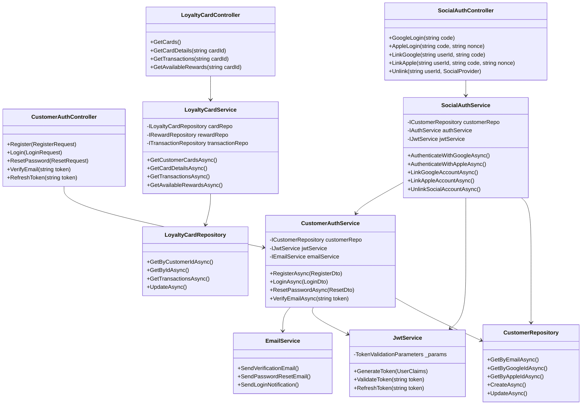
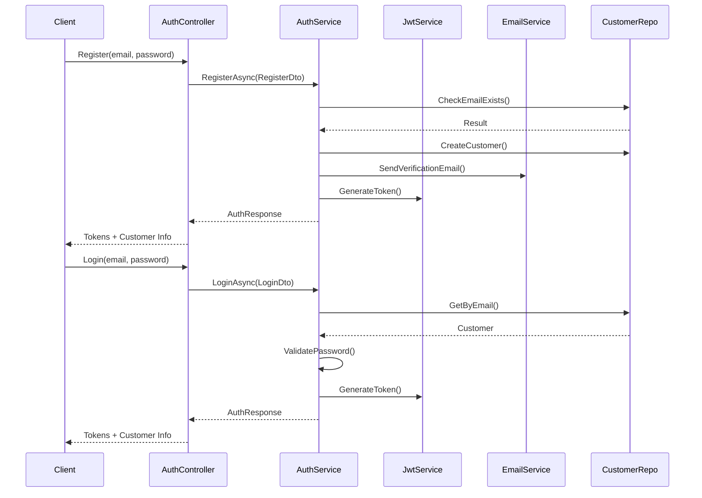
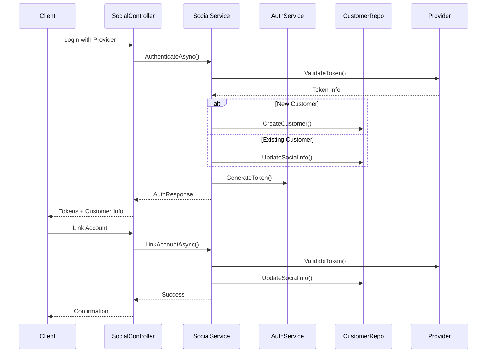
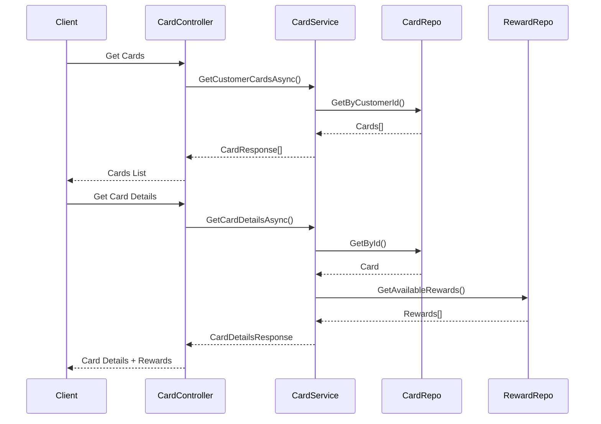

# Customer API Architecture

## 1. Component Overview

```mermaid
classDiagram
    %% Controllers
    class CustomerAuthController {
        +Register(RegisterRequest)
        +Login(LoginRequest)
        +ResetPassword(ResetRequest)
        +VerifyEmail(string token)
        +RefreshToken(string token)
    }

    class SocialAuthController {
        +GoogleLogin(string code)
        +AppleLogin(string code, string nonce)
        +LinkGoogle(string userId, string code)
        +LinkApple(string userId, string code, string nonce)
        +Unlink(string userId, SocialProvider)
    }

    class LoyaltyCardController {
        +GetCards()
        +GetCardDetails(string cardId)
        +GetTransactions(string cardId)
        +GetAvailableRewards(string cardId)
    }

    %% Services
    class CustomerAuthService {
        -ICustomerRepository customerRepo
        -IJwtService jwtService
        -IEmailService emailService
        +RegisterAsync(RegisterDto)
        +LoginAsync(LoginDto)
        +ResetPasswordAsync(ResetDto)
        +VerifyEmailAsync(string token)
    }

    class SocialAuthService {
        -ICustomerRepository customerRepo
        -IAuthService authService
        -IJwtService jwtService
        +AuthenticateWithGoogleAsync()
        +AuthenticateWithAppleAsync()
        +LinkGoogleAccountAsync()
        +LinkAppleAccountAsync()
        +UnlinkSocialAccountAsync()
    }

    class LoyaltyCardService {
        -ILoyaltyCardRepository cardRepo
        -IRewardRepository rewardRepo
        -ITransactionRepository transactionRepo
        +GetCustomerCardsAsync()
        +GetCardDetailsAsync()
        +GetTransactionsAsync()
        +GetAvailableRewardsAsync()
    }

    %% Repositories
    class CustomerRepository {
        +GetByEmailAsync()
        +GetByGoogleIdAsync()
        +GetByAppleIdAsync()
        +CreateAsync()
        +UpdateAsync()
    }

    class LoyaltyCardRepository {
        +GetByCustomerIdAsync()
        +GetByIdAsync()
        +GetTransactionsAsync()
        +UpdateAsync()
    }

    %% Infrastructure Services
    class JwtService {
        -TokenValidationParameters _params
        +GenerateToken(UserClaims)
        +ValidateToken(string token)
        +RefreshToken(string token)
    }

    class EmailService {
        +SendVerificationEmail()
        +SendPasswordResetEmail()
        +SendLoginNotification()
    }

    %% Relationships
    CustomerAuthController --> CustomerAuthService
    SocialAuthController --> SocialAuthService
    LoyaltyCardController --> LoyaltyCardService

    CustomerAuthService --> CustomerRepository
    CustomerAuthService --> JwtService
    CustomerAuthService --> EmailService

    SocialAuthService --> CustomerRepository
    SocialAuthService --> JwtService
    SocialAuthService --> CustomerAuthService

    LoyaltyCardService --> LoyaltyCardRepository
```

## 2. Authentication Flow

```mermaid
sequenceDiagram
    participant Client
    participant AuthController
    participant AuthService
    participant JwtService
    participant EmailService
    participant CustomerRepo

    %% Registration Flow
    Client->>AuthController: Register(email, password)
    AuthController->>AuthService: RegisterAsync(RegisterDto)
    AuthService->>CustomerRepo: CheckEmailExists()
    CustomerRepo-->>AuthService: Result
    AuthService->>CustomerRepo: CreateCustomer()
    AuthService->>EmailService: SendVerificationEmail()
    AuthService->>JwtService: GenerateToken()
    AuthService-->>AuthController: AuthResponse
    AuthController-->>Client: Tokens + Customer Info

    %% Login Flow
    Client->>AuthController: Login(email, password)
    AuthController->>AuthService: LoginAsync(LoginDto)
    AuthService->>CustomerRepo: GetByEmail()
    CustomerRepo-->>AuthService: Customer
    AuthService->>AuthService: ValidatePassword()
    AuthService->>JwtService: GenerateToken()
    AuthService-->>AuthController: AuthResponse
    AuthController-->>Client: Tokens + Customer Info
```

## 3. Social Authentication Flow

```mermaid
sequenceDiagram
    participant Client
    participant SocialController
    participant SocialService
    participant AuthService
    participant CustomerRepo
    participant Provider

    %% Social Login Flow
    Client->>SocialController: Login with Provider
    SocialController->>SocialService: AuthenticateAsync()
    SocialService->>Provider: ValidateToken()
    Provider-->>SocialService: Token Info

    alt New Customer
        SocialService->>CustomerRepo: CreateCustomer()
    else Existing Customer
        SocialService->>CustomerRepo: UpdateSocialInfo()
    end

    SocialService->>AuthService: GenerateToken()
    SocialService-->>SocialController: AuthResponse
    SocialController-->>Client: Tokens + Customer Info

    %% Account Linking Flow
    Client->>SocialController: Link Account
    SocialController->>SocialService: LinkAccountAsync()
    SocialService->>Provider: ValidateToken()
    SocialService->>CustomerRepo: UpdateSocialInfo()
    SocialService-->>SocialController: Success
    SocialController-->>Client: Confirmation
```

## 4. Loyalty Card Flow

```mermaid
sequenceDiagram
    participant Client
    participant CardController
    participant CardService
    participant CardRepo
    participant RewardRepo

    %% Get Cards Flow
    Client->>CardController: Get Cards
    CardController->>CardService: GetCustomerCardsAsync()
    CardService->>CardRepo: GetByCustomerId()
    CardRepo-->>CardService: Cards[]
    CardService-->>CardController: CardResponse[]
    CardController-->>Client: Cards List

    %% Get Card Details Flow
    Client->>CardController: Get Card Details
    CardController->>CardService: GetCardDetailsAsync()
    CardService->>CardRepo: GetById()
    CardRepo-->>CardService: Card
    CardService->>RewardRepo: GetAvailableRewards()
    RewardRepo-->>CardService: Rewards[]
    CardService-->>CardController: CardDetailsResponse
    CardController-->>Client: Card Details + Rewards
``` 