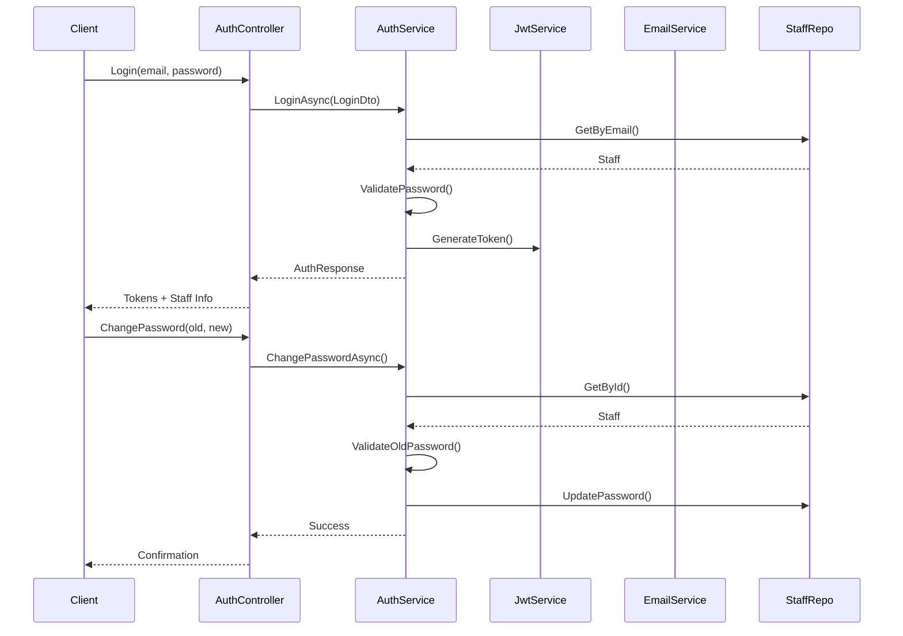
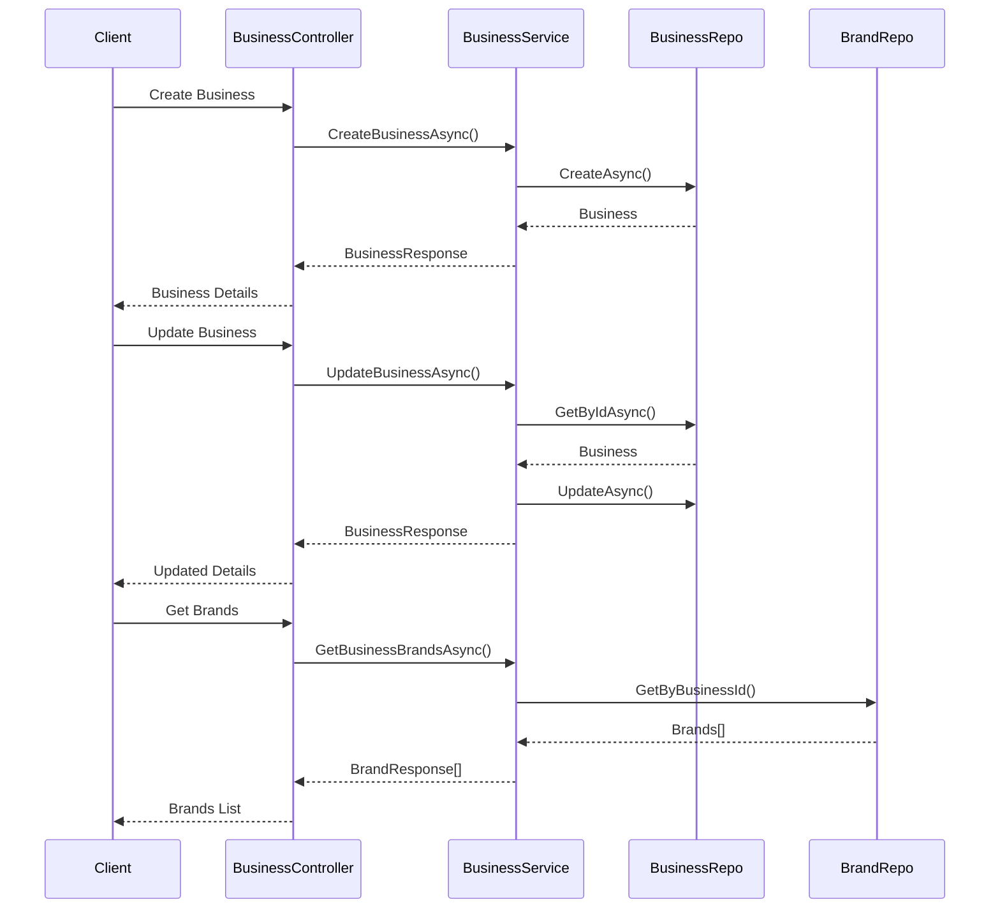
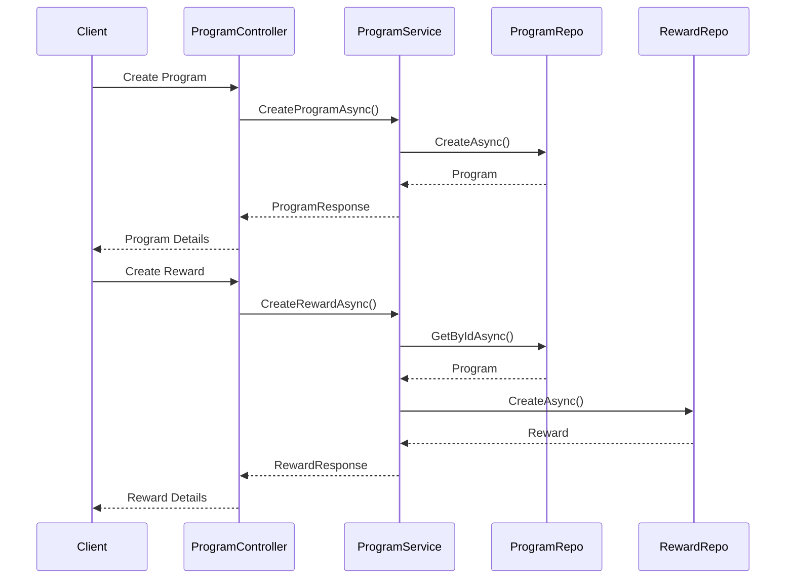

# Admin API Architecture

## 1. Component Overview

```mermaid
classDiagram
    %% Controllers
    class StaffAuthController {
        +Login(LoginRequest)
        +RefreshToken(string token)
        +ChangePassword(ChangePasswordRequest)
        +ResetPassword(ResetRequest)
    }

    class BusinessController {
        +CreateBusiness(CreateBusinessRequest)
        +UpdateBusiness(UpdateBusinessRequest)
        +GetBusinessDetails(string businessId)
        +GetBusinessBrands(string businessId)
    }

    class BrandController {
        +CreateBrand(CreateBrandRequest)
        +UpdateBrand(UpdateBrandRequest)
        +GetBrandDetails(string brandId)
        +GetBrandStores(string brandId)
    }

    class LoyaltyProgramController {
        +CreateProgram(CreateProgramRequest)
        +UpdateProgram(UpdateProgramRequest)
        +GetProgramDetails(string programId)
        +CreateReward(CreateRewardRequest)
        +UpdateReward(UpdateRewardRequest)
    }

    class StaffManagementController {
        +CreateStaff(CreateStaffRequest)
        +UpdateStaff(UpdateStaffRequest)
        +AssignToStore(AssignmentRequest)
        +RemoveFromStore(AssignmentRequest)
    }

    %% Services
    class StaffAuthService {
        -IStaffRepository staffRepo
        -IJwtService jwtService
        -IEmailService emailService
        +LoginAsync(LoginDto)
        +RefreshTokenAsync(string token)
        +ChangePasswordAsync(ChangePasswordDto)
        +ResetPasswordAsync(ResetDto)
    }

    class BusinessService {
        -IBusinessRepository businessRepo
        -IBrandRepository brandRepo
        +CreateBusinessAsync(CreateBusinessDto)
        +UpdateBusinessAsync(UpdateBusinessDto)
        +GetBusinessDetailsAsync(string id)
        +GetBusinessBrandsAsync(string id)
    }

    class BrandService {
        -IBrandRepository brandRepo
        -IStoreRepository storeRepo
        +CreateBrandAsync(CreateBrandDto)
        +UpdateBrandAsync(UpdateBrandDto)
        +GetBrandDetailsAsync(string id)
        +GetBrandStoresAsync(string id)
    }

    class LoyaltyProgramService {
        -IProgramRepository programRepo
        -IRewardRepository rewardRepo
        +CreateProgramAsync(CreateProgramDto)
        +UpdateProgramAsync(UpdateProgramDto)
        +GetProgramDetailsAsync(string id)
        +CreateRewardAsync(CreateRewardDto)
        +UpdateRewardAsync(UpdateRewardDto)
    }

    class StaffManagementService {
        -IStaffRepository staffRepo
        -IStoreRepository storeRepo
        +CreateStaffAsync(CreateStaffDto)
        +UpdateStaffAsync(UpdateStaffDto)
        +AssignToStoreAsync(AssignmentDto)
        +RemoveFromStoreAsync(AssignmentDto)
    }

    %% Repositories
    class StaffRepository {
        +GetByEmailAsync()
        +GetByIdAsync()
        +CreateAsync()
        +UpdateAsync()
    }

    class BusinessRepository {
        +GetByIdAsync()
        +CreateAsync()
        +UpdateAsync()
        +GetBrandsAsync()
    }

    class BrandRepository {
        +GetByIdAsync()
        +CreateAsync()
        +UpdateAsync()
        +GetStoresAsync()
    }

    class ProgramRepository {
        +GetByIdAsync()
        +CreateAsync()
        +UpdateAsync()
        +GetRewardsAsync()
    }

    %% Infrastructure Services
    class JwtService {
        -TokenValidationParameters _params
        +GenerateToken(UserClaims)
        +ValidateToken(string token)
        +RefreshToken(string token)
    }

    class EmailService {
        +SendPasswordResetEmail()
        +SendLoginNotification()
    }

    %% Relationships
    StaffAuthController --> StaffAuthService
    BusinessController --> BusinessService
    BrandController --> BrandService
    LoyaltyProgramController --> LoyaltyProgramService
    StaffManagementController --> StaffManagementService

    StaffAuthService --> StaffRepository
    StaffAuthService --> JwtService
    StaffAuthService --> EmailService

    BusinessService --> BusinessRepository
    BusinessService --> BrandRepository

    BrandService --> BrandRepository
    BrandService --> StoreRepository

    LoyaltyProgramService --> ProgramRepository
    LoyaltyProgramService --> RewardRepository

    StaffManagementService --> StaffRepository
    StaffManagementService --> StoreRepository
```

## 2. Staff Authentication Flow

```mermaid
sequenceDiagram
    participant Client
    participant AuthController
    participant AuthService
    participant JwtService
    participant EmailService
    participant StaffRepo

    %% Login Flow
    Client->>AuthController: Login(email, password)
    AuthController->>AuthService: LoginAsync(LoginDto)
    AuthService->>StaffRepo: GetByEmail()
    StaffRepo-->>AuthService: Staff
    AuthService->>AuthService: ValidatePassword()
    AuthService->>JwtService: GenerateToken()
    AuthService-->>AuthController: AuthResponse
    AuthController-->>Client: Tokens + Staff Info

    %% Password Change Flow
    Client->>AuthController: ChangePassword(old, new)
    AuthController->>AuthService: ChangePasswordAsync()
    AuthService->>StaffRepo: GetById()
    StaffRepo-->>AuthService: Staff
    AuthService->>AuthService: ValidateOldPassword()
    AuthService->>StaffRepo: UpdatePassword()
    AuthService-->>AuthController: Success
    AuthController-->>Client: Confirmation
```

## 3. Business Management Flow

```mermaid
sequenceDiagram
    participant Client
    participant BusinessController
    participant BusinessService
    participant BusinessRepo
    participant BrandRepo

    %% Create Business Flow
    Client->>BusinessController: Create Business
    BusinessController->>BusinessService: CreateBusinessAsync()
    BusinessService->>BusinessRepo: CreateAsync()
    BusinessRepo-->>BusinessService: Business
    BusinessService-->>BusinessController: BusinessResponse
    BusinessController-->>Client: Business Details

    %% Update Business Flow
    Client->>BusinessController: Update Business
    BusinessController->>BusinessService: UpdateBusinessAsync()
    BusinessService->>BusinessRepo: GetByIdAsync()
    BusinessRepo-->>BusinessService: Business
    BusinessService->>BusinessRepo: UpdateAsync()
    BusinessService-->>BusinessController: BusinessResponse
    BusinessController-->>Client: Updated Details

    %% Get Business Brands Flow
    Client->>BusinessController: Get Brands
    BusinessController->>BusinessService: GetBusinessBrandsAsync()
    BusinessService->>BrandRepo: GetByBusinessId()
    BrandRepo-->>BusinessService: Brands[]
    BusinessService-->>BusinessController: BrandResponse[]
    BusinessController-->>Client: Brands List
```

## 4. Loyalty Program Management Flow

```mermaid
sequenceDiagram
    participant Client
    participant ProgramController
    participant ProgramService
    participant ProgramRepo
    participant RewardRepo

    %% Create Program Flow
    Client->>ProgramController: Create Program
    ProgramController->>ProgramService: CreateProgramAsync()
    ProgramService->>ProgramRepo: CreateAsync()
    ProgramRepo-->>ProgramService: Program
    ProgramService-->>ProgramController: ProgramResponse
    ProgramController-->>Client: Program Details

    %% Create Reward Flow
    Client->>ProgramController: Create Reward
    ProgramController->>ProgramService: CreateRewardAsync()
    ProgramService->>ProgramRepo: GetByIdAsync()
    ProgramRepo-->>ProgramService: Program
    ProgramService->>RewardRepo: CreateAsync()
    RewardRepo-->>ProgramService: Reward
    ProgramService-->>ProgramController: RewardResponse
    ProgramController-->>Client: Reward Details
``` 