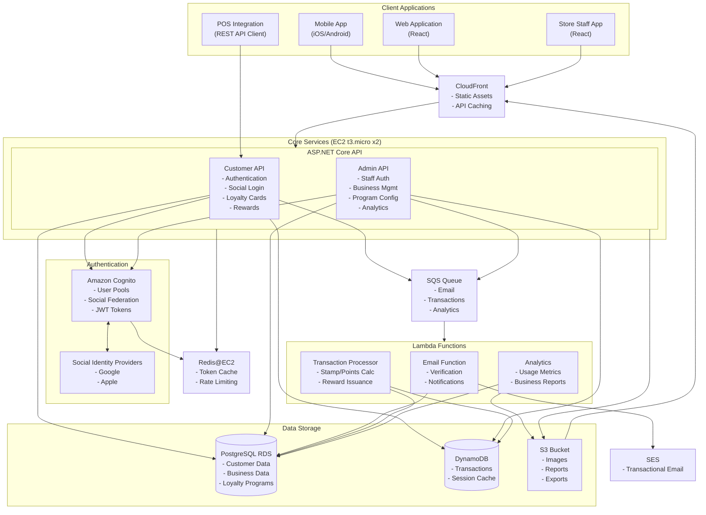

# Cost-Optimized Loyalty System Architecture

## 1. Optimized Architecture Diagram

## 2. Architecture Justification

Based on the analysis of the Loyalty System codebase and requirements, this architecture is designed to optimize costs while maintaining all necessary functionality. Here's why this architecture is appropriate:

### 2.1 Domain Model Alignment

The existing codebase has a clear domain model centered around:

- **Business entities** (Business, Brand, Store)
- **Loyalty programs** (Programs, Rewards)
- **Customer interactions** (Cards, Transactions)
- **Authentication** (Staff and Customer, including social login)

The architecture directly supports this domain model by:

- Separating Customer and Admin APIs but hosting them on the same infrastructure
- Using Cognito for authentication which supports both social login and staff authentication
- Providing dedicated data storage for the main entity types
- Using serverless components for asynchronous processes like reward calculation

### 2.2 Existing Authentication Requirements

The codebase includes:

- `SocialAuthService` for Google and Apple authentication
- `StaffAuthorizationService` for staff authentication
- JWT-based authentication system

This is addressed by:

- Using Cognito for authentication management
- Supporting social login integration with existing identity providers
- Maintaining separate authentication workflows for customers and staff
- Caching tokens in Redis for performance

### 2.3 Loyalty Transaction Processing

The system needs to process loyalty transactions efficiently, including:

- Stamp issuance
- Points calculation
- Reward redemption

This is handled by:

- Using Lambda for transaction processing to handle spikes without maintaining always-on resources
- DynamoDB for high-throughput transaction logging
- SQS for deferring processing during high-load periods
- Redis for caching frequently accessed data like loyalty card balances

### 2.4 Cost Optimization Strategy

The architecture optimizes costs by:

- **Consolidation**: Using t3.micro EC2 instances for the API instead of container services
- **Serverless**: Using Lambda for background processing that doesn't require always-on resources
- **Managed Services**: Using Cognito instead of building a custom auth system
- **Free Tier Usage**: Leveraging AWS Free Tier offerings (EC2, RDS, DynamoDB, Lambda, SQS)
- **Right-sizing**: Using appropriate service tiers for the expected workload

## 3. Service Selection Rationale

### 3.1 EC2 (t3.micro) for API Services

- **Why**: The monolithic code structure in the codebase can be deployed to a single EC2 instance
- **Free Tier**: 750 hours/month (effectively one instance always running)
- **Scalability**: Can be placed behind a load balancer when traffic grows
- **Benefits**: Simpler deployment, easier debugging, reduced operational complexity

### 3.2 Amazon Cognito for Authentication

- **Why**: The existing `SocialAuthService` functionality matches Cognito's capabilities
- **Free Tier**: 50,000 MAUs included
- **Features**: Supports social logins, JWT token issuance, user management
- **Benefits**: Eliminates need to maintain auth infrastructure, improves security

### 3.3 PostgreSQL RDS for Primary Data

- **Why**: The domain model is highly relational with many relationships between entities
- **Free Tier**: 750 hours/month of db.t3.micro
- **Design**: Schema separation for different domains (Business, Loyalty, Customer)
- **Benefits**: ACID compliance for critical business data, familiar SQL interface

### 3.4 DynamoDB for Transactions

- **Why**: Transaction volume can be high and requires fast writes
- **Free Tier**: 25GB storage + 25 WCU/RCU
- **Usage**: Store transaction records and session data
- **Benefits**: Scalable throughput, pay-per-use model, low latency

### 3.5 Lambda for Background Processing

- **Why**: Email, analytics, and reward processing are asynchronous tasks
- **Free Tier**: 1M requests/month and 400,000 GB-seconds
- **Triggers**: SQS messages, scheduled events
- **Benefits**: No idle resources, scales automatically with demand

### 3.6 Redis for Caching

- **Why**: Token caching and rate limiting require in-memory performance
- **Approach**: Host on EC2 instead of ElastiCache to reduce costs
- **Usage**: Auth token cache, API request rate limiting, frequent queries
- **Benefits**: Reduced database load, improved API response times

## 4. Deployment and Scaling Strategy

### 4.1 Initial Deployment (Free Tier)

- Deploy Customer API and Admin API to a single EC2 instance
- Use RDS Single-AZ for development/testing
- Set up CloudFront for static asset delivery
- Configure Cognito for authentication
- Implement Lambda functions for background processing

### 4.2 Growth Path

1. **0-5,000 Users**:
   - Single EC2 instance for API
   - Single RDS instance
   - Lambda for background processing

2. **5,000-25,000 Users**:
   - Add a second EC2 instance with load balancer
   - Implement CloudFront caching for API responses
   - Consider RDS read replicas for read-heavy workloads

3. **25,000+ Users**:
   - Split Customer and Admin APIs to separate Auto Scaling Groups
   - Move to ElastiCache for Redis instead of self-managed
   - Consider DynamoDB DAX for caching
   - Implement more granular Lambda functions

### 4.3 Monitoring and Optimization

- Set up CloudWatch dashboards for resource utilization
- Implement custom metrics for business KPIs
- Use X-Ray for API tracing
- Regularly review and optimize based on usage patterns

## 5. Security Considerations

- Cognito handles authentication security
- CloudFront provides HTTPS and WAF capabilities
- Redis ensures token storage is secure
- IAM roles limit access between services
- Database encryption at rest

## 6. Cost Comparison

| Component | Free Tier Optimized | Full Microservices |
|-----------|---------------------|-------------------|
| Compute | 2x EC2 t3.micro ($0 in free tier) | ECS Fargate (8+ containers, ~$150-300) |
| Database | RDS t3.micro + DynamoDB ($0 in free tier) | RDS Multi-AZ + DynamoDB + ElastiCache (~$200-350) |
| Auth | Cognito ($0 for <50K users) | Custom services on ECS (~$50-100) |
| Other | Lambda, S3, SQS ($0-5) | Lambda, S3, SQS, API Gateway (~$50-100) |
| **Total** | **$0-10/month** (free tier) | **$450-750/month** |

This architecture provides a balanced approach that meets all the functional requirements identified in the codebase while minimizing cloud costs, especially during the development and early adoption phases. 