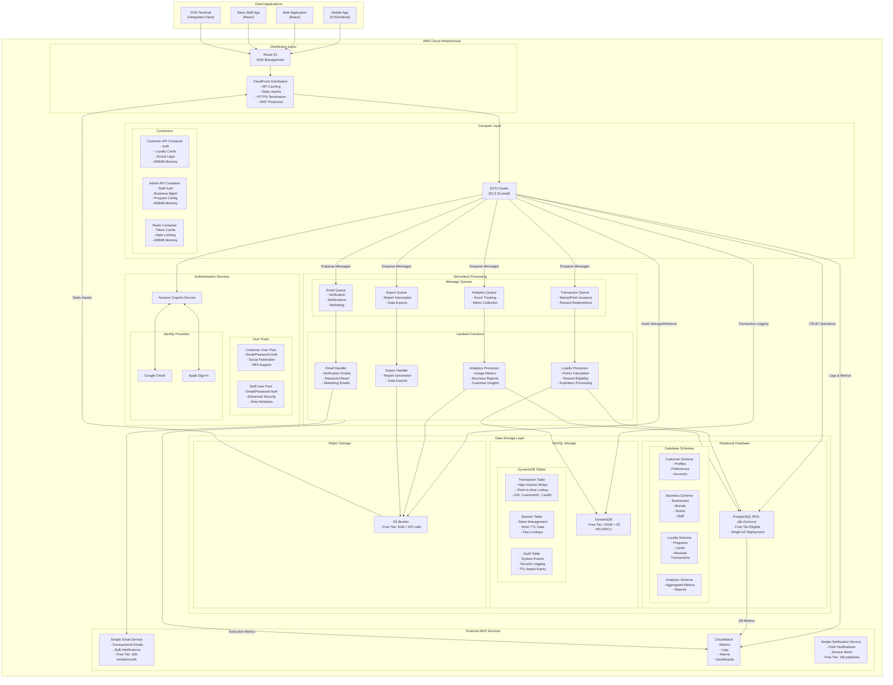
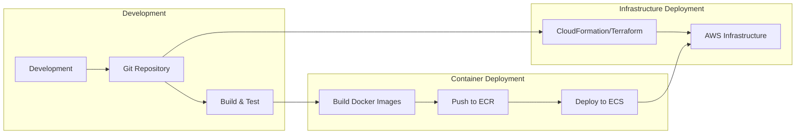

# Loyalty System: Deployment Architecture

This document outlines the finalized deployment architecture for the Loyalty System, focusing on AWS-based hosting with cost optimization for initial deployment while maintaining a clear path to scaling.

## 1. Architecture Overview

### 1.1 Cost-Optimized AWS Architecture



### 1.2 Key Architectural Decisions

1. **Hybrid Compute Approach**
   - Core APIs hosted in ECS containers on EC2
   - Asynchronous/background processing in Lambda functions
   - Message queues (SQS) for decoupling and workload smoothing

2. **Authentication**
   - Amazon Cognito for both customer and staff authentication
   - Separate user pools with different security policies
   - Social authentication through Cognito identity providers

3. **Data Storage Strategy**
   - PostgreSQL RDS for relational data (using schema separation)
   - DynamoDB for high-throughput transaction logging
   - Redis for in-memory caching (token cache, rate limiting)
   - S3 for object storage and static assets

4. **Containerization**
   - ECS on EC2 with three distinct containers
   - Separate containers for Customer API, Admin API, and Redis
   - Resource limits defined per container

## 2. Compute Strategy Analysis

### 2.1 EC2/ECS vs. Serverless Lambda

We evaluated a full serverless approach but selected a hybrid model for the following reasons:

| Aspect | ECS/EC2 (Core APIs) | Lambda (Background Processing) |
|--------|---------------------|--------------------------------|
| **Cold Start** | No cold starts for APIs | Acceptable for async operations |
| **Stateful Operations** | Easier to implement | More complex |
| **Cost Model** | Predictable, EC2 pricing | Pay-per-execution |
| **Free Tier** | 750 hrs t3.micro/month | 1M requests + 400K GB-sec/month |
| **Development** | Traditional API development | Function-based development |
| **Authentication** | Complex flows easy to implement | More complex for social auth |

**Decision Rationale**: The hybrid approach maximizes the benefits of both models while staying within free tier limits. Critical, latency-sensitive operations use ECS while background processing uses Lambda.

### 2.2 Container Resource Allocation

For a t3.small instance (2GB RAM):

| Container | Memory Allocation | CPU Allocation | Justification |
|-----------|------------------|----------------|---------------|
| Customer API | 900MB | 1024 CPU units | Higher customer traffic, social auth processing |
| Admin API | 600MB | 512 CPU units | Lower traffic, administrative functions |
| Redis | 400MB | 256 CPU units | In-memory caching, token storage |

**Decision Rationale**: A t3.micro (1GB RAM) would be insufficient for running all three containers. The t3.small provides sufficient memory with reasonable cost (~$18-20/month if beyond free tier).

## 3. Data Storage Strategy

### 3.1 Storage Technology Selection

We use multiple storage technologies for different data patterns:

| Technology | Usage | Justification |
|------------|-------|---------------|
| **PostgreSQL** | Core business data, relationships | Strong ACID compliance, relational model supports complex joins, schema separation maintains boundaries |
| **DynamoDB** | Transaction logs, session data | High throughput, scale-independent performance, built-in TTL for sessions, GSIs for efficient queries |
| **Redis** | Token cache, rate limiting | Sub-millisecond access for frequent reads, data structures for rate limiting, acceptable data loss |
| **S3** | Static assets, exports, backups | Cost-effective object storage, integration with CloudFront for CDN |

**Decision Rationale**: Each storage technology is selected based on the specific data pattern it serves best, with consideration for cost, performance, and durability requirements.

### 3.2 Schema Design

PostgreSQL database is organized into distinct schemas:

```sql
-- Schema separation example
CREATE SCHEMA customer;
CREATE SCHEMA business;
CREATE SCHEMA loyalty;
CREATE SCHEMA analytics;

-- Cross-schema references
CREATE TABLE loyalty.cards (
    id UUID PRIMARY KEY,
    customer_id UUID NOT NULL REFERENCES customer.customers(id),
    program_id UUID NOT NULL REFERENCES business.loyalty_programs(id)
);
```

**Decision Rationale**: Schema separation provides logical isolation while still allowing for cross-schema relationships, all within a single RDS instance to minimize costs.

## 4. Project Structure & Containerization

### 4.1 Project to Container Mapping

The current project structure aligns well with our containerization strategy:

| Project | Container | Description |
|---------|-----------|-------------|
| LoyaltySystem.Customer.API | Customer API Container | Customer-facing endpoints |
| LoyaltySystem.Admin.API | Admin API Container | Admin/staff endpoints |
| LoyaltySystem.Staff.API | Consider merging with Admin API | Staff-specific functionality |
| LoyaltySystem.Application | Shared by both containers | Core application services |
| LoyaltySystem.Domain | Shared by both containers | Domain models and business logic |
| LoyaltySystem.Infrastructure | Shared by both containers | Data access, external services |

**Decision Rationale**: The existing project structure cleanly separates concerns while sharing common functionality, which maps perfectly to a containerized deployment model.

### 4.2 Containerization Implementation

#### Docker Files

Each API project should have its own Dockerfile:

```dockerfile
# src/LoyaltySystem.Customer.API/Dockerfile
FROM mcr.microsoft.com/dotnet/aspnet:7.0 AS base
WORKDIR /app
EXPOSE 80

FROM mcr.microsoft.com/dotnet/sdk:7.0 AS build
WORKDIR /src
COPY ["LoyaltySystem.Customer.API/LoyaltySystem.Customer.API.csproj", "LoyaltySystem.Customer.API/"]
COPY ["LoyaltySystem.Application/LoyaltySystem.Application.csproj", "LoyaltySystem.Application/"]
COPY ["LoyaltySystem.Domain/LoyaltySystem.Domain.csproj", "LoyaltySystem.Domain/"]
COPY ["LoyaltySystem.Infrastructure/LoyaltySystem.Infrastructure.csproj", "LoyaltySystem.Infrastructure/"]
COPY ["LoyaltySystem.Shared.API/LoyaltySystem.Shared.API.csproj", "LoyaltySystem.Shared.API/"]
RUN dotnet restore "LoyaltySystem.Customer.API/LoyaltySystem.Customer.API.csproj"
COPY . .
WORKDIR "/src/LoyaltySystem.Customer.API"
RUN dotnet build "LoyaltySystem.Customer.API.csproj" -c Release -o /app/build

FROM build AS publish
RUN dotnet publish "LoyaltySystem.Customer.API.csproj" -c Release -o /app/publish

FROM base AS final
WORKDIR /app
COPY --from=publish /app/publish .
ENTRYPOINT ["dotnet", "LoyaltySystem.Customer.API.dll"]
```

#### ECS Task Definition

```json
{
  "family": "loyalty-system",
  "networkMode": "awsvpc",
  "executionRoleArn": "arn:aws:iam::123456789012:role/ecsTaskExecutionRole",
  "containerDefinitions": [
    {
      "name": "customer-api",
      "image": "123456789012.dkr.ecr.us-east-1.amazonaws.com/customer-api:latest",
      "essential": true,
      "portMappings": [
        {
          "containerPort": 80,
          "hostPort": 80,
          "protocol": "tcp"
        }
      ],
      "memory": 900,
      "cpu": 1024,
      "environment": [
        {
          "name": "ASPNETCORE_ENVIRONMENT",
          "value": "Production"
        }
      ],
      "logConfiguration": {
        "logDriver": "awslogs",
        "options": {
          "awslogs-group": "/ecs/loyalty-system",
          "awslogs-region": "us-east-1",
          "awslogs-stream-prefix": "customer-api"
        }
      }
    },
    {
      "name": "admin-api",
      "image": "123456789012.dkr.ecr.us-east-1.amazonaws.com/admin-api:latest",
      "essential": true,
      "portMappings": [
        {
          "containerPort": 80,
          "hostPort": 8080,
          "protocol": "tcp"
        }
      ],
      "memory": 600,
      "cpu": 512,
      "environment": [
        {
          "name": "ASPNETCORE_ENVIRONMENT",
          "value": "Production"
        }
      ],
      "logConfiguration": {
        "logDriver": "awslogs",
        "options": {
          "awslogs-group": "/ecs/loyalty-system",
          "awslogs-region": "us-east-1",
          "awslogs-stream-prefix": "admin-api"
        }
      }
    },
    {
      "name": "redis",
      "image": "redis:alpine",
      "essential": true,
      "memory": 400,
      "cpu": 256,
      "portMappings": [
        {
          "containerPort": 6379,
          "hostPort": 6379,
          "protocol": "tcp"
        }
      ]
    }
  ],
  "requiresCompatibilities": [
    "EC2"
  ],
  "cpu": "2048",
  "memory": "1900"
}
```

## 5. Scaling Strategy

### 5.1 Initial Deployment (First 6-12 months)

- EC2: t3.small with ECS (3 containers)
- RDS: db.t3.micro (single AZ)
- DynamoDB: On-demand capacity
- Cognito: Basic configuration
- Lambda: Minimal functions for background processing

### 5.2 Growth Phase (10,000+ users)

- EC2: Add second t3.small in different AZ
- RDS: Add read replica for read-heavy operations
- DynamoDB: Maintain on-demand capacity
- ElastiCache: Consider migrating Redis to ElastiCache
- Load Balancer: Add Application Load Balancer

### 5.3 Scale-Out Phase (25,000+ users)

- EC2: Auto Scaling Group with t3.medium instances
- RDS: Upgrade to higher instance class
- DynamoDB: Global tables for multi-region deployment
- ElastiCache: Dedicated Redis cluster
- Lambda: Add more specific Lambda functions for domain operations

## 6. Cost Analysis

### 6.1 Initial Deployment Cost (Monthly)

| Component | Configuration | Free Tier Coverage | Monthly Cost (Beyond Free Tier) |
|-----------|---------------|-------------------|---------------------------------|
| EC2 (ECS) | t3.small | 750 hrs of t3.micro | $18-20 |
| RDS | db.t3.micro single AZ | 750 hrs | $12-15 |
| DynamoDB | On-demand, minimal usage | 25GB storage, 25 WCU/RCU | $0-5 |
| S3 | Standard storage 5GB | 5GB | $0-1 |
| CloudFront | Minimal transfer | 50GB/mo | $0-3 |
| Cognito | Basic auth | 50,000 MAU | $0 |
| Lambda | Background processing | 1M requests | $0-2 |
| SQS | Message queues | 1M requests | $0 |
| **Total** | | | **$30-45** |

### 6.2 Cost Optimization Strategies

1. **Free Tier Maximization**
   - Use free tier offerings during initial development
   - Multiple AWS services offer 12-month free tier benefits

2. **Right-sizing**
   - Start with t3.small EC2 instead of larger instances
   - Use single-AZ RDS initially
   - Container resource allocation based on actual needs

3. **Serverless for Variable Workloads**
   - Lambda for infrequent operations
   - SQS for workload smoothing
   - S3 for static content

4. **Monitoring and Optimization**
   - CloudWatch dashboards for resource utilization
   - Optimize container resource allocations based on actual usage
   - Regular review of DynamoDB access patterns

## 7. Backup & Recovery Strategy

### 7.1 Database Backups

- **RDS**: 
  - Daily automated snapshots (retained for 7 days)
  - Manual snapshots before major changes
  - Point-in-time recovery enabled

- **DynamoDB**:
  - Point-in-time recovery enabled
  - Weekly on-demand backups

### 7.2 Application Backup

- **EC2/ECS**:
  - AMI backups of the EC2 instance
  - Docker images stored in ECR
  - Infrastructure as Code for environment recreation

- **S3**:
  - Versioning enabled for critical buckets
  - Cross-region replication for disaster recovery

### 7.3 Recovery Process

1. Database recovery:
   - RDS: Restore from latest snapshot
   - DynamoDB: Restore from on-demand backup or point-in-time

2. Application recovery:
   - Deploy containers from latest ECR images
   - Update Route53/CloudFront to point to new infrastructure

## 8. CI/CD Pipeline

### 8.1 Proposed Pipeline



### 8.2 Implementation

1. **GitHub Actions or AWS CodePipeline** for CI/CD automation
2. **Docker Multi-stage Builds** for optimized container images
3. **Infrastructure as Code** using CloudFormation or Terraform
4. **Automated Testing** before deployment

## 9. Conclusion and Recommendations

The proposed architecture balances cost optimization with scalability needs:

1. **Start with containerization** on a single t3.small instance
2. **Leverage serverless** for background processing
3. **Use managed services** where beneficial (Cognito, SQS)
4. **Implement proper monitoring** to identify scaling needs
5. **Define clear growth thresholds** for infrastructure expansion

This approach provides a cost-effective initial deployment while maintaining a clear path to scaling as user numbers grow. 