# Customer API Architecture

## 1. Component Overview
```mermaid
classDiagram
    %% Controllers
    class CustomerAuthController {
        +Register(RegisterRequest)
        +Login(LoginRequest)
        +ResetPassword(ResetRequest)
        +VerifyEmail(string token)
        +RefreshToken(string token)
    }

    class SocialAuthController {
        +GoogleLogin(string code)
        +AppleLogin(string code, string nonce)
        +LinkGoogle(string userId, string code)
        +LinkApple(string userId, string code, string nonce)
        +Unlink(string userId, SocialProvider)
    }

    class LoyaltyCardController {
        +GetCards()
        +GetCardDetails(string cardId)
        +GetTransactions(string cardId)
        +GetAvailableRewards(string cardId)
    }

    class WebhookController {
        +RegisterWebhook(WebhookRequest)
        +ListWebhooks()
        +DeleteWebhook(string webhookId)
    }

    class NotificationController {
        +GetPreferences()
        +UpdatePreferences(NotificationPreferencesRequest)
        +ListNotifications()
    }

    class SupportController {
        +CreateTicket(SupportTicketRequest)
        +ListTickets()
        +UpdateTicketStatus(string ticketId, string status)
    }

    %% Services
    class CustomerAuthService {
        -ICustomerRepository customerRepo
        -IJwtService jwtService
        -IEmailService emailService
        +RegisterAsync(RegisterDto)
        +LoginAsync(LoginDto)
        +ResetPasswordAsync(ResetDto)
        +VerifyEmailAsync(string token)
    }

    class SocialAuthService {
        -ICustomerRepository customerRepo
        -IAuthService authService
        -IJwtService jwtService
        +AuthenticateWithGoogleAsync()
        +AuthenticateWithAppleAsync()
        +LinkGoogleAccountAsync()
        +LinkAppleAccountAsync()
        +UnlinkSocialAccountAsync()
    }

    class LoyaltyCardService {
        -ILoyaltyCardRepository cardRepo
        -IRewardRepository rewardRepo
        -ITransactionRepository transactionRepo
        +GetCustomerCardsAsync()
        +GetCardDetailsAsync()
        +GetTransactionsAsync()
        +GetAvailableRewardsAsync()
    }

    class WebhookService {
        -IWebhookRepository webhookRepo
        +RegisterWebhookAsync()
        +ListWebhooksAsync()
        +DeleteWebhookAsync()
    }

    class NotificationService {
        -INotificationRepository notificationRepo
        +GetPreferencesAsync()
        +UpdatePreferencesAsync()
        +ListNotificationsAsync()
    }

    class SupportService {
        -ISupportRepository supportRepo
        +CreateTicketAsync()
        +ListTicketsAsync()
        +UpdateTicketStatusAsync()
    }

    class AuditLogService {
        -IAuditLogRepository auditLogRepo
        +LogActionAsync()
        +GetLogsAsync()
    }

    class ApiClientService {
        -IApiClientRepository apiClientRepo
        +RegisterClientAsync()
        +ListClientsAsync()
        +RevokeClientAsync()
    }

    class LocalizationService {
        -ILocalizationRepository localizationRepo
        +GetTranslationsAsync()
        +SetLanguageAsync()
    }

    class PrivacyService {
        -IPrivacyRepository privacyRepo
        +RequestDataExportAsync()
        +RequestAccountDeletionAsync()
    }

    class RewardFulfillmentService {
        -IRewardRedemptionRepository rewardRedemptionRepo
        +RequestRedemptionAsync()
        +UpdateRedemptionStatusAsync()
    }

    %% Repositories
    class CustomerRepository {
        +GetByEmailAsync()
        +GetByGoogleIdAsync()
        +GetByAppleIdAsync()
        +CreateAsync()
        +UpdateAsync()
    }

    class LoyaltyCardRepository {
        +GetByCustomerIdAsync()
        +GetByIdAsync()
        +GetTransactionsAsync()
        +UpdateAsync()
    }

    class RewardRepository {
        +GetByCustomerIdAsync()
        +GetByIdAsync()
        +GetTransactionsAsync()
        +UpdateAsync()
    }

    class TransactionRepository {
        +GetByCustomerIdAsync()
        +GetByIdAsync()
        +GetTransactionsAsync()
        +UpdateAsync()
    }

    class WebhookRepository {
        +GetByCustomerIdAsync()
        +GetByIdAsync()
        +GetTransactionsAsync()
        +UpdateAsync()
    }

    class NotificationRepository {
        +GetByCustomerIdAsync()
        +GetByIdAsync()
        +GetTransactionsAsync()
        +UpdateAsync()
    }

    class SupportRepository {
        +GetByCustomerIdAsync()
        +GetByIdAsync()
        +GetTransactionsAsync()
        +UpdateAsync()
    }

    class AuditLogRepository {
        +GetByCustomerIdAsync()
        +GetByIdAsync()
        +GetTransactionsAsync()
        +UpdateAsync()
    }

    class ApiClientRepository {
        +GetByCustomerIdAsync()
        +GetByIdAsync()
        +GetTransactionsAsync()
        +UpdateAsync()
    }

    class LocalizationRepository {
        +GetByCustomerIdAsync()
        +GetByIdAsync()
        +GetTransactionsAsync()
        +UpdateAsync()
    }

    class PrivacyRepository {
        +GetByCustomerIdAsync()
        +GetByIdAsync()
        +GetTransactionsAsync()
        +UpdateAsync()
    }

    class RewardRedemptionRepository {
        +GetByCustomerIdAsync()
        +GetByIdAsync()
        +GetTransactionsAsync()
        +UpdateAsync()
    }

    %% Infrastructure Services
    class JwtService {
        -TokenValidationParameters _params
        +GenerateToken(UserClaims)
        +ValidateToken(string token)
        +RefreshToken(string token)
    }

    class EmailService {
        +SendVerificationEmail()
        +SendPasswordResetEmail()
        +SendLoginNotification()
    }

    %% Relationships
    CustomerAuthController --> CustomerAuthService
    SocialAuthController --> SocialAuthService
    LoyaltyCardController --> LoyaltyCardService
    WebhookController --> WebhookService
    NotificationController --> NotificationService
    SupportController --> SupportService
    CustomerAuthService --> CustomerRepository
    CustomerAuthService --> JwtService
    CustomerAuthService --> EmailService
    SocialAuthService --> CustomerRepository
    SocialAuthService --> JwtService
    SocialAuthService --> CustomerAuthService
    LoyaltyCardService --> LoyaltyCardRepository
    LoyaltyCardService --> RewardRepository
    LoyaltyCardService --> TransactionRepository
    WebhookService --> WebhookRepository
    NotificationService --> NotificationRepository
    SupportService --> SupportRepository
    AuditLogService --> AuditLogRepository
    ApiClientService --> ApiClientRepository
    LocalizationService --> LocalizationRepository
    PrivacyService --> PrivacyRepository
    RewardFulfillmentService --> RewardRedemptionRepository
```

## 2. Authentication Flow
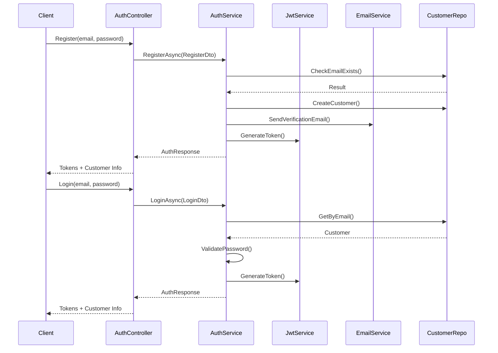

## 3. Social Authentication Flow
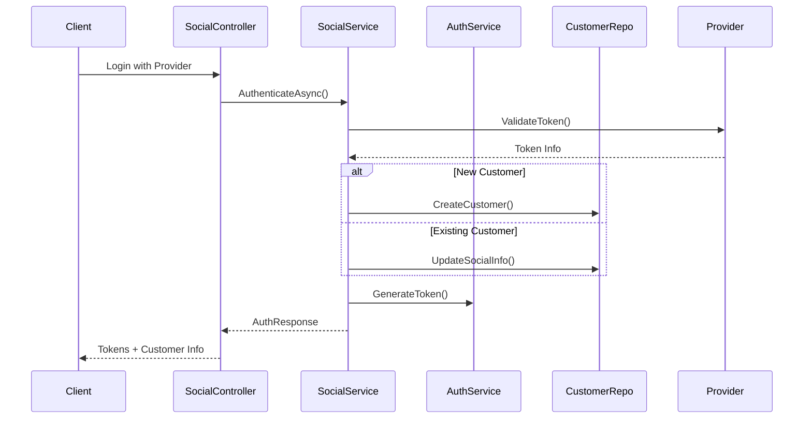
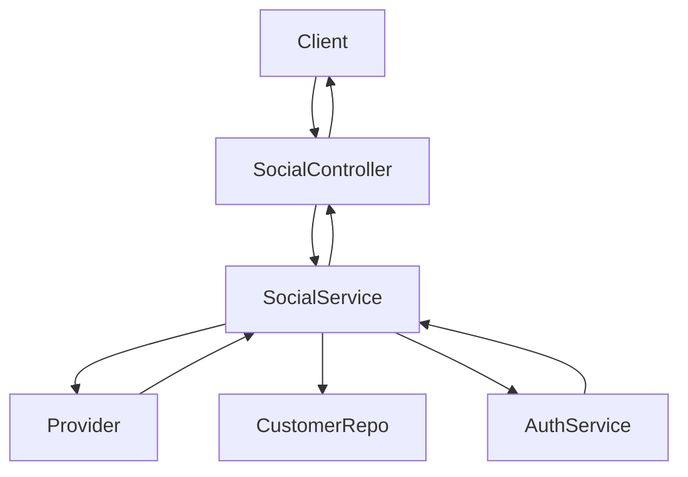

## 4. Loyalty Card Flow
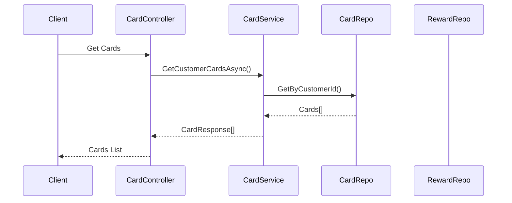
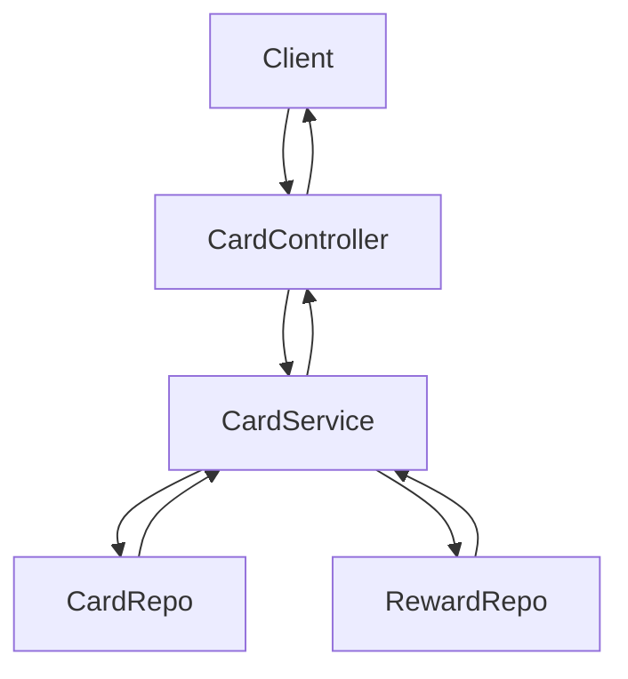

## 5. Customer API Flows (Expanded)

### 5.1 Authentication Flows
**Purpose:** Customer registration, login, password reset, email verification, and token refresh.

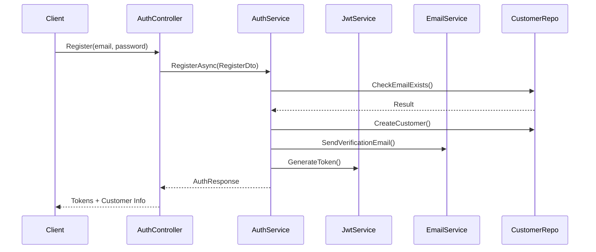
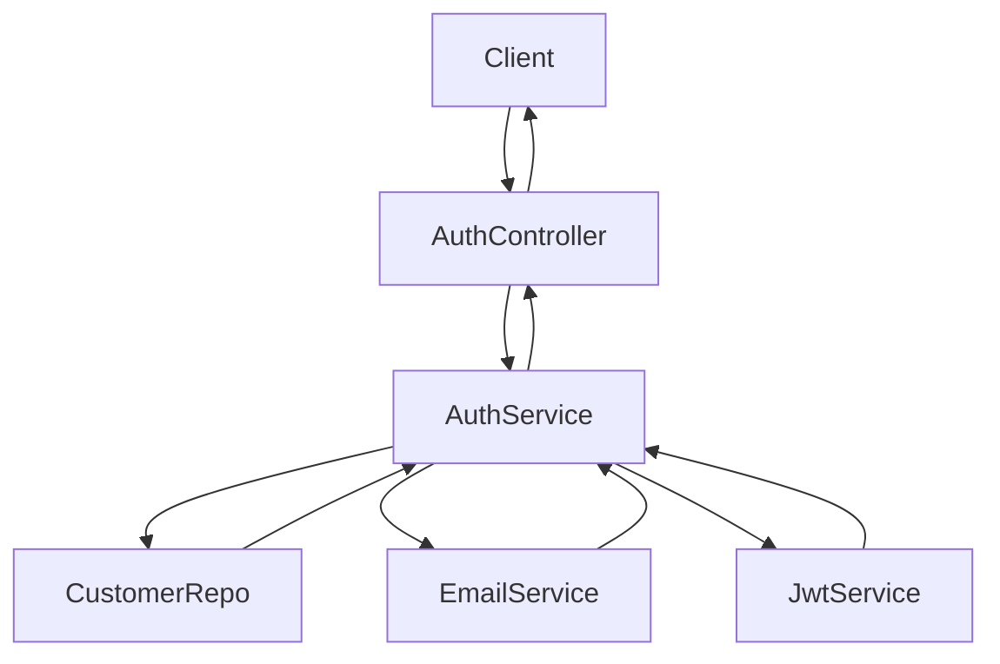

### 5.2 Social Authentication Flows
**Purpose:** Login and account linking via Google/Apple.


### 5.3 Loyalty Card Flows
**Purpose:** View cards, card details, transactions, and available rewards.


### 5.4 Reward Redemption Flow
**Purpose:** Redeem a reward using a loyalty card.

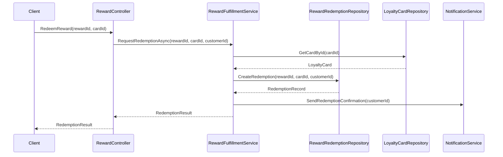
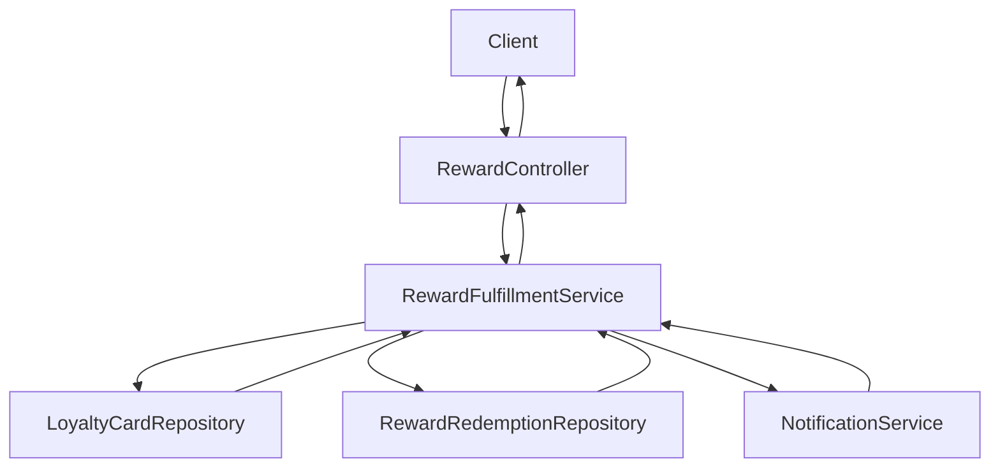

### 5.5 Reward Program Enrollment Flow
**Purpose:** Enroll a customer in a loyalty program.

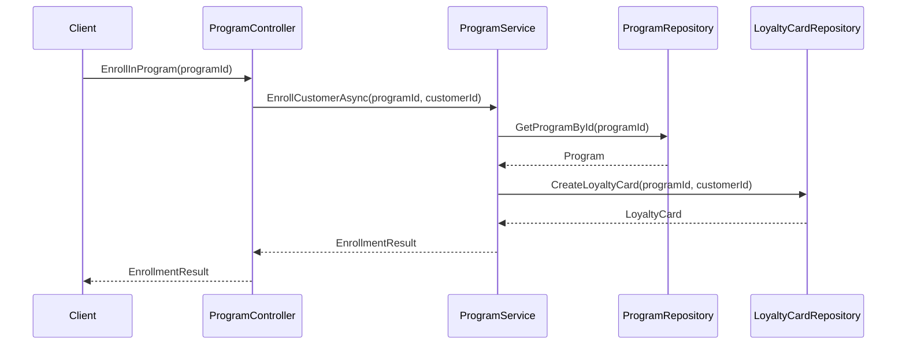
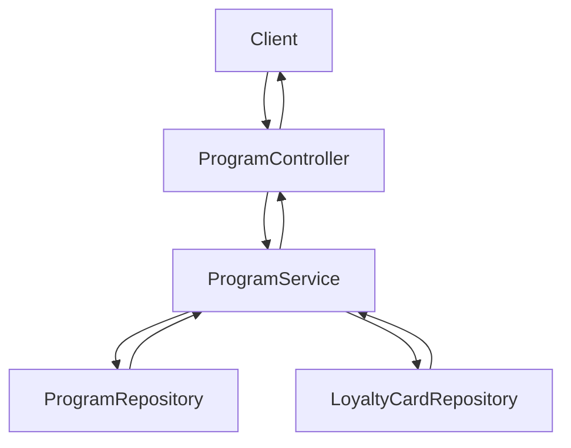

### 5.6 Webhook Management Flow
**Purpose:** Register, list, and delete webhooks for event notifications.

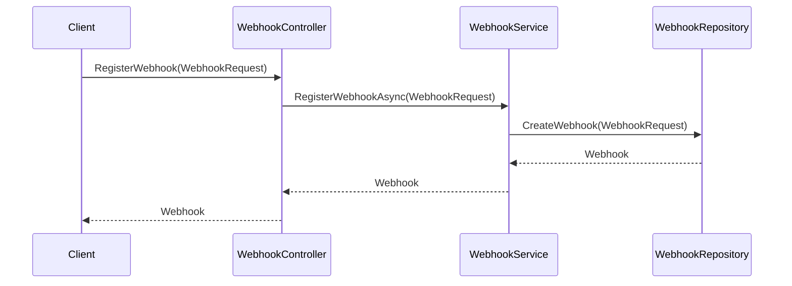
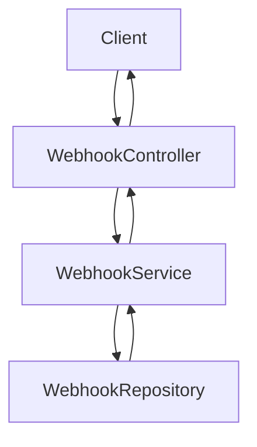

### 5.7 Notification Preferences & Delivery Flow
**Purpose:** Manage notification preferences and view notifications.

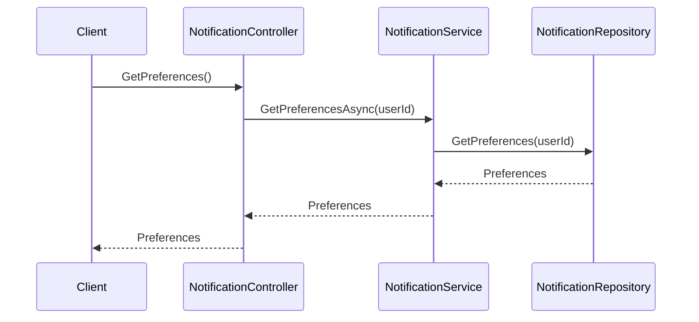
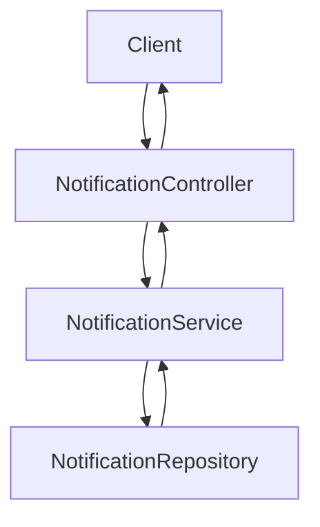

### 5.8 Support Ticket Flow
**Purpose:** Create, list, and update support tickets.

```mermaid
sequenceDiagram
    participant Client
    participant SupportController
    participant SupportService
    participant SupportRepository
    Client->>SupportController: CreateTicket(SupportTicketRequest)
    SupportController->>SupportService: CreateTicketAsync(SupportTicketRequest)
    SupportService->>SupportRepository: CreateTicket(SupportTicketRequest)
    SupportRepository-->>SupportService: Ticket
    SupportService-->>SupportController: Ticket
    SupportController-->>Client: Ticket
```
```mermaid
flowchart TD
    A[Client] --> B[SupportController]
    B --> C[SupportService]
    C --> D[SupportRepository]
    D --> C
    C --> B
    B --> A
```

### 5.9 Privacy & Compliance Flow
**Purpose:** Request data export or account deletion.

```mermaid
sequenceDiagram
    participant Client
    participant PrivacyController
    participant PrivacyService
    participant PrivacyRepository
    Client->>PrivacyController: RequestDataExport()
    PrivacyController->>PrivacyService: RequestDataExportAsync(userId)
    PrivacyService->>PrivacyRepository: CreateDataExportRequest(userId)
    PrivacyRepository-->>PrivacyService: DataExportRequest
    PrivacyService-->>PrivacyController: DataExportRequest
    PrivacyController-->>Client: DataExportRequest
```
```mermaid
flowchart TD
    A[Client] --> B[PrivacyController]
    B --> C[PrivacyService]
    C --> D[PrivacyRepository]
    D --> C
    C --> B
    B --> A
```

### 5.10 Localization Flow
**Purpose:** Get/set language and retrieve translations.

```mermaid
sequenceDiagram
    participant Client
    participant LocalizationController
    participant LocalizationService
    participant LocalizationRepository
    Client->>LocalizationController: SetLanguage(languageCode)
    LocalizationController->>LocalizationService: SetLanguageAsync(userId, languageCode)
    LocalizationService->>LocalizationRepository: UpdateUserLanguage(userId, languageCode)
    LocalizationRepository-->>LocalizationService: Success
    LocalizationService-->>LocalizationController: Success
    LocalizationController-->>Client: Success
```
```mermaid
flowchart TD
    A[Client] --> B[LocalizationController]
    B --> C[LocalizationService]
    C --> D[LocalizationRepository]
    D --> C
    C --> B
    B --> A
```

### 5.11 API Client Management Flow
**Purpose:** Register, list, and revoke API clients.

```mermaid
sequenceDiagram
    participant Client
    participant ApiClientController
    participant ApiClientService
    participant ApiClientRepository
    Client->>ApiClientController: RegisterClient(ApiClientRequest)
    ApiClientController->>ApiClientService: RegisterClientAsync(ApiClientRequest)
    ApiClientService->>ApiClientRepository: CreateApiClient(ApiClientRequest)
    ApiClientRepository-->>ApiClientService: ApiClient
    ApiClientService-->>ApiClientController: ApiClient
    ApiClientController-->>Client: ApiClient
```
```mermaid
flowchart TD
    A[Client] --> B[ApiClientController]
    B --> C[ApiClientService]
    C --> D[ApiClientRepository]
    D --> C
    C --> B
    B --> A
```

### 5.12 Audit Log Flow
**Purpose:** Log and retrieve audit actions.

```mermaid
sequenceDiagram
    participant Client
    participant AuditLogController
    participant AuditLogService
    participant AuditLogRepository
    Client->>AuditLogController: GetLogs()
    AuditLogController->>AuditLogService: GetLogsAsync(userId)
    AuditLogService->>AuditLogRepository: GetLogs(userId)
    AuditLogRepository-->>AuditLogService: Logs[]
    AuditLogService-->>AuditLogController: Logs[]
    AuditLogController-->>Client: Logs[]
```
```mermaid
flowchart TD
    A[Client] --> B[AuditLogController]
    B --> C[AuditLogService]
    C --> D[AuditLogRepository]
    D --> C
    C --> B
    B --> A
``` 