# Infrastructure Architecture

## 1. Overall System Architecture

```mermaid
graph TB
    %% Client Applications
    subgraph Clients["Client Applications"]
        MobileApp["Mobile App\n(iOS/Android)"]
        WebApp["Web Application\n(React)"]
        POS["POS Integration\n(REST API Client)"]
    end

    %% API Gateway Layer
    subgraph APIG["API Gateway"]
        CustomerAPI["Customer API Gateway"]
        AdminAPI["Admin API Gateway"]
        PosAPI["POS API Gateway"]
    end

    %% Application Services
    subgraph ECS["ECS Cluster"]
        subgraph CustomerServices["Customer Services"]
            AuthService["Authentication Service\nECS Fargate"]
            LoyaltyService["Loyalty Service\nECS Fargate"]
            CustomerService["Customer Service\nECS Fargate"]
        end
        
        subgraph AdminServices["Admin Services"]
            AdminAuthService["Admin Auth Service\nECS Fargate"]
            BusinessService["Business Service\nECS Fargate"]
            ProgramService["Program Service\nECS Fargate"]
        end
        
        subgraph POSServices["POS Services"]
            TransactionService["Transaction Service\nECS Fargate"]
            CardLinkService["Card Link Service\nECS Fargate"]
        end
    end

    %% Serverless Functions
    subgraph Lambda["Lambda Functions"]
        EmailHandler["Email Handler"]
        NotificationHandler["Notification Handler"]
        RewardProcessor["Reward Processor"]
        AnalyticsProcessor["Analytics Processor"]
    end

    %% Message Queues
    subgraph SQS["Message Queues"]
        EmailQueue["Email Queue"]
        NotificationQueue["Notification Queue"]
        TransactionQueue["Transaction Queue"]
        AnalyticsQueue["Analytics Queue"]
    end

    %% Databases
    subgraph Storage["Data Storage"]
        subgraph RDS["Amazon RDS"]
            CustomerDB[(Customer Database)]
            LoyaltyDB[(Loyalty Database)]
            BusinessDB[(Business Database)]
        end
        
        subgraph DynamoDB["DynamoDB"]
            TransactionTable[("Transaction\nTable")]
            SessionTable[("Session\nTable")]
        end
        
        subgraph ElastiCache["Redis ElastiCache"]
            SessionCache{{"Session Cache"}}
            RateLimit{{"Rate Limiting"}}
        end
    end

    %% External Services
    subgraph External["External Services"]
        SES["AWS SES\n(Email)"]
        SNS["AWS SNS\n(Notifications)"]
        S3["S3\n(File Storage)"]
        CloudFront["CloudFront\n(CDN)"]
    end

    %% Connections - Client to API
    MobileApp --> CustomerAPI
    WebApp --> CustomerAPI
    WebApp --> AdminAPI
    POS --> PosAPI

    %% API Gateway to Services
    CustomerAPI --> CustomerServices
    AdminAPI --> AdminServices
    PosAPI --> POSServices

    %% Service to Queue Connections
    CustomerService --> EmailQueue
    LoyaltyService --> NotificationQueue
    TransactionService --> TransactionQueue
    CustomerService --> AnalyticsQueue

    %% Queue to Lambda Connections
    EmailQueue --> EmailHandler
    NotificationQueue --> NotificationHandler
    TransactionQueue --> RewardProcessor
    AnalyticsQueue --> AnalyticsProcessor

    %% Service to Database Connections
    CustomerService --> CustomerDB
    LoyaltyService --> LoyaltyDB
    BusinessService --> BusinessDB
    TransactionService --> TransactionTable
    AuthService --> SessionTable
    AdminAuthService --> SessionTable

    %% Cache Connections
    AuthService --> SessionCache
    AdminAuthService --> SessionCache
    CustomerAPI --> RateLimit
    AdminAPI --> RateLimit
    PosAPI --> RateLimit

    %% External Service Connections
    EmailHandler --> SES
    NotificationHandler --> SNS
    CustomerService --> S3
    S3 --> CloudFront
```

## 2. Service Deployment Details

### 2.1 Container Services (ECS Fargate)
- **Authentication Services**
  - Deployed as containerized services on ECS Fargate
  - Auto-scaling based on CPU/Memory utilization
  - Load balanced across multiple availability zones
  - Health checks and automatic container replacement

- **Business Services**
  - Containerized microservices architecture
  - Service discovery using AWS Cloud Map
  - Circuit breakers and retry policies
  - Distributed tracing with AWS X-Ray

- **Loyalty Services**
  - Event-driven architecture using SQS/SNS
  - Asynchronous processing of rewards and points
  - Real-time transaction processing
  - Caching layer for frequent queries

### 2.2 Serverless Components
- **Lambda Functions**
  - Email handling and templating
  - Push notification distribution
  - Reward calculation and processing
  - Analytics and reporting
  - Scheduled tasks and maintenance

### 2.3 Data Storage
- **RDS (PostgreSQL)**
  - Customer data
  - Business and program configurations
  - Loyalty program data
  - Multi-AZ deployment for high availability

- **DynamoDB**
  - High-throughput transaction logging
  - Session management
  - Time-series data
  - Auto-scaling based on demand

- **ElastiCache (Redis)**
  - Session caching
  - Rate limiting
  - Temporary data storage
  - Real-time leaderboards

### 2.4 Security Components
- **API Gateway**
  - JWT validation
  - Rate limiting
  - API key management
  - Request/Response transformation

- **WAF & Shield**
  - DDoS protection
  - SQL injection prevention
  - Cross-site scripting protection
  - IP-based filtering

## 3. Scaling Strategy

### 3.1 Horizontal Scaling
- ECS Services auto-scale based on:
  - CPU utilization
  - Memory utilization
  - Request count
  - Custom metrics

### 3.2 Database Scaling
- RDS:
  - Read replicas for read-heavy workloads
  - Automated backups and point-in-time recovery
  - Storage auto-scaling

- DynamoDB:
  - On-demand capacity mode
  - Global tables for multi-region deployment
  - DAX for read-heavy workloads

### 3.3 Caching Strategy
- Multi-layer caching:
  - CloudFront for static assets
  - API Gateway cache for responses
  - ElastiCache for application data
  - DAX for DynamoDB queries

## 4. Monitoring and Observability

### 4.1 CloudWatch Integration
- Metrics collection
- Log aggregation
- Alarm configuration
- Dashboard creation

### 4.2 Tracing and Debugging
- X-Ray integration
- Distributed tracing
- Service maps
- Performance insights

### 4.3 Alerting
- SNS notifications
- PagerDuty integration
- Slack notifications
- Email alerts 