# Detailed Cost-Optimized Architecture

## Comprehensive System Architecture

```mermaid
graph TB
    %% Client Applications Layer
    subgraph Clients["Client Applications"]
        MobileApp["Mobile App\n(iOS/Android)"]
        WebApp["Web Application\n(React)"]
        PosTerminal["POS Terminal\n(Integrated Client)"]
        StaffApp["Store Staff App\n(React)"]
    end

    %% Infrastructure Layer
    subgraph CloudInfra["AWS Cloud Infrastructure"]
        %% DNS & CDN
        subgraph Distribution["Distribution Layer"]
            Route53["Route 53\nDNS Management"]
            CF["CloudFront Distribution\n- API Caching\n- Static Assets\n- HTTPS Termination\n- WAF Protection"]
        end

        %% Compute Layer
        subgraph Compute["Compute Layer"]
            EC2["EC2 t3.micro\n(Single Instance)\n- ASP.NET Core API\n- Redis Cache"]
            
            subgraph APIComponents["API Components"]
                %% Customer API Stack
                CustAuth["Customer Auth\n- Login/Register\n- JWT Management\n- Social Login Integration"]
                CustLoyalty["Loyalty Management\n- Card Operations\n- Points/Stamps\n- Rewards"]
                CustProfile["Profile Management\n- Customer Data\n- Preferences"]
                
                %% Admin API Stack
                AdminAuth["Admin Auth\n- Staff Login\n- Permissions"]
                BusinessMgmt["Business Management\n- Businesses\n- Brands\n- Stores"]
                ProgramMgmt["Program Management\n- Loyalty Programs\n- Rewards\n- Campaigns"]
            end
        end
        
        %% Authentication Services
        subgraph AuthServices["Authentication Services"]
            CognitoService["Amazon Cognito Service"]
            
            subgraph CognitoPools["User Pools"]
                CustomerPool["Customer User Pool\n- Email/Password Auth\n- Social Federation\n- MFA Support"]
                StaffPool["Staff User Pool\n- Email/Password Auth\n- Enhanced Security\n- Role Attributes"]
            end
            
            subgraph IdentityProviders["Identity Providers"]
                GoogleIDP["Google OAuth"]
                AppleIDP["Apple Sign-In"]
            end
            
            subgraph TokenHandling["Token Management"]
                JWTIssuer["JWT Token Issuer"]
                TokenValidation["Token Validation"]
            end
        end
        
        %% Serverless Processing
        subgraph Serverless["Serverless Processing"]
            subgraph LambdaFunctions["Lambda Functions"]
                EmailLambda["Email Handler\n- Verification Emails\n- Password Reset\n- Marketing Emails\n- Triggers: SQS, Schedule"]
                
                LoyaltyLambda["Loyalty Processor\n- Points Calculation\n- Reward Eligibility\n- Expiration Processing\n- Triggers: SQS, API"]
                
                AnalyticsLambda["Analytics Processor\n- Usage Metrics\n- Business Reports\n- Customer Insights\n- Triggers: Schedule, SQS"]
                
                ExportLambda["Export Handler\n- Report Generation\n- Data Exports\n- Triggers: API, Schedule"]
            end
            
            subgraph QueueSystem["Message Queues"]
                EmailQueue["Email Queue\n- Verification\n- Notifications\n- Marketing"]
                
                TransactionQueue["Transaction Queue\n- Stamp/Point Issuance\n- Reward Redemptions\n- Cancellations"]
                
                AnalyticsQueue["Analytics Queue\n- Event Tracking\n- Metric Collection"]
                
                ExportQueue["Export Queue\n- Report Generation\n- Data Exports"]
            end
        end
        
        %% Data Storage Layer
        subgraph DataStorage["Data Storage Layer"]
            subgraph RelationalDB["Relational Database"]
                RDS["PostgreSQL RDS (db.t3.micro)\n- Free Tier Eligible\n- Single AZ Deployment"]
                
                subgraph Schemas["Database Schemas"]
                    CustomerSchema["Customer Schema\n- Profiles\n- Preferences\n- Accounts"]
                    
                    BusinessSchema["Business Schema\n- Businesses\n- Brands\n- Stores\n- Staff"]
                    
                    LoyaltySchema["Loyalty Schema\n- Programs\n- Cards\n- Rewards\n- Transactions"]
                    
                    AnalyticsSchema["Analytics Schema\n- Aggregated Metrics\n- Reports"]
                end
            end
            
            subgraph NoSQL["NoSQL Storage"]
                DDB["DynamoDB\n- Free Tier: 25GB + 25 WCU/RCU"]
                
                subgraph Tables["DynamoDB Tables"]
                    TransactionTable["Transaction Table\n- High-Volume Writes\n- Point-in-time Lookup\n- GSI: CustomerID, CardID"]
                    
                    SessionTable["Session Table\n- Token Management\n- Short TTL Data\n- Fast Lookups"]
                    
                    AuditTable["Audit Table\n- System Events\n- Security Logging\n- TTL-based Expiry"]
                end
            end
            
            subgraph ObjectStorage["Object Storage"]
                S3Bucket["S3 Bucket\n- Free Tier: 5GB + API calls"]
                
                subgraph S3Folders["Storage Organization"]
                    PublicAssets["Public Assets\n- Logos\n- Program Images\n- Static Content"]
                    
                    Reports["Reports\n- Generated PDFs\n- Exports\n- Backups"]
                    
                    CustomerUploads["Customer Uploads\n- Profile Images\n- Receipts"]
                    
                    SystemBackups["System Backups\n- Config Backups\n- Logs Archive"]
                end
            end
            
            subgraph Cache["In-Memory Cache"]
                RedisInstance["Redis on EC2\n- Part of EC2 Instance\n- Avoids ElastiCache Cost"]
                
                subgraph CacheData["Cached Data"]
                    TokenCache["Token Cache\n- Auth Tokens\n- Short Lifespan\n- Fast Validation"]
                    
                    AppCache["Application Cache\n- Frequent Queries\n- Program Data\n- Store Information"]
                    
                    RateLimitCache["Rate Limiting\n- API Request Tracking\n- Throttling Control"]
                end
            end
        end
        
        %% External Services
        subgraph ExternalServices["External AWS Services"]
            SES["Simple Email Service\n- Transactional Emails\n- Bulk Notifications\n- Free Tier: 62K emails/month"]
            
            CloudWatch["CloudWatch\n- Metrics\n- Logs\n- Alarms\n- Dashboards"]
            
            SNS["Simple Notification Service\n- Push Notifications\n- Service Alerts\n- Free Tier: 1M publishes"]
        end
    end

    %% Third-Party Services
    subgraph ThirdParty["Third-Party Services"]
        PaymentGateway["Payment Gateway\n(Optional Integration)"]
        GoogleCloud["Google Cloud\n(OAuth Endpoint)"]
        AppleAuth["Apple Auth Services"]
    end

    %% Network Flow (Simplified Major Paths)
    %% Client to Distribution
    MobileApp --> Route53
    WebApp --> Route53
    StaffApp --> Route53
    PosTerminal --> Route53
    Route53 --> CF
    
    %% Distribution to Compute
    CF --> EC2
    
    %% Auth Flows
    EC2 -- "Auth Requests" --> CognitoService
    CognitoService <--> GoogleIDP
    CognitoService <--> AppleIDP
    CognitoService -- "JWT Tokens" --> TokenCache
    
    %% Data Access Patterns
    EC2 -- "CRUD Operations" --> RDS
    EC2 -- "Transaction Logging" --> DDB
    EC2 -- "Asset Storage/Retrieval" --> S3Bucket
    EC2 -- "Cache Operations" --> RedisInstance
    
    %% Async Flows
    EC2 -- "Enqueue Messages" --> EmailQueue
    EC2 -- "Enqueue Messages" --> TransactionQueue
    EC2 -- "Enqueue Messages" --> AnalyticsQueue
    EC2 -- "Enqueue Messages" --> ExportQueue
    
    %% Queue Processing
    EmailQueue --> EmailLambda
    TransactionQueue --> LoyaltyLambda
    AnalyticsQueue --> AnalyticsLambda
    ExportQueue --> ExportLambda
    
    %% Lambda to Services
    EmailLambda --> SES
    LoyaltyLambda --> RDS
    LoyaltyLambda --> DDB
    AnalyticsLambda --> RDS
    AnalyticsLambda --> S3Bucket
    ExportLambda --> S3Bucket
    ExportLambda --> SES
    
    %% External Services
    EC2 <--> PaymentGateway
    
    %% Monitoring
    EC2 -- "Logs & Metrics" --> CloudWatch
    RDS -- "DB Metrics" --> CloudWatch
    LambdaFunctions -- "Execution Metrics" --> CloudWatch
    
    %% S3 to CloudFront
    S3Bucket -- "Static Assets" --> CF
```



## Key Implementation Details

### 1. API Implementation on EC2 Instance

The ASP.NET Core API hosted on a single EC2 t3.micro instance is implemented with:

- **Program Structure:**
  ```csharp
  var builder = WebApplication.CreateBuilder(args);

  // Customer API Services
  builder.Services.AddScoped<ICustomerAuthService, CustomerAuthService>();
  builder.Services.AddScoped<ILoyaltyCardService, LoyaltyCardService>();
  builder.Services.AddScoped<ISocialAuthService, SocialAuthService>();

  // Admin API Services
  builder.Services.AddScoped<IStaffAuthService, StaffAuthService>();
  builder.Services.AddScoped<IBusinessService, BusinessService>();
  builder.Services.AddScoped<ILoyaltyProgramService, LoyaltyProgramService>();

  // Cross-cutting concerns
  builder.Services.AddSingleton<ICacheService>(provider => 
      new RedisCacheService(Configuration.GetConnectionString("Redis")));
  builder.Services.AddSingleton<IRateLimitService, RateLimitService>();
  
  // Cognito Integration
  builder.Services.AddCognitoIdentity();
  builder.Services.AddAuthentication(options => {
      options.DefaultAuthenticateScheme = JwtBearerDefaults.AuthenticationScheme;
      options.DefaultChallengeScheme = JwtBearerDefaults.AuthenticationScheme;
  })
  .AddJwtBearer(options => {
      options.Authority = $"https://cognito-idp.{region}.amazonaws.com/{userPoolId}";
      options.TokenValidationParameters = new TokenValidationParameters {
          ValidateIssuerSigningKey = true,
          ValidateIssuer = true,
          ValidateAudience = false,
          ValidateLifetime = true
      };
  });
  ```

### 2. Database Schema Design

The PostgreSQL database is organized into distinct schemas to maintain separation while using a single instance:

- **Customer Schema:**
  ```sql
  CREATE SCHEMA customer;
  
  CREATE TABLE customer.customers (
      id UUID PRIMARY KEY,
      email VARCHAR(255) UNIQUE NOT NULL,
      name VARCHAR(255) NOT NULL,
      phone VARCHAR(50),
      joined_at TIMESTAMP NOT NULL DEFAULT NOW(),
      google_id VARCHAR(255),
      apple_id VARCHAR(255),
      marketing_consent BOOLEAN DEFAULT FALSE
  );
  ```

- **Business Schema:**
  ```sql
  CREATE SCHEMA business;
  
  CREATE TABLE business.businesses (
      id UUID PRIMARY KEY,
      name VARCHAR(255) NOT NULL,
      description TEXT,
      tax_id VARCHAR(100),
      logo_url VARCHAR(500),
      website VARCHAR(255),
      is_active BOOLEAN DEFAULT TRUE,
      created_at TIMESTAMP NOT NULL DEFAULT NOW()
  );
  
  CREATE TABLE business.brands (
      id UUID PRIMARY KEY,
      business_id UUID NOT NULL REFERENCES business.businesses(id),
      name VARCHAR(255) NOT NULL,
      /* other fields */
  );
  ```

### 3. DynamoDB Table Design

DynamoDB tables are designed for high-throughput operations with careful partition key selection:

- **Transaction Table:**
  ```
  Primary Key: TransactionId (String)
  GSI1: CustomerId-Timestamp (Composite)
  GSI2: CardId-Timestamp (Composite)
  
  Attributes:
  - TransactionId
  - CardId
  - CustomerId
  - TransactionType (ENUM: STAMP_ISSUANCE, POINTS_ADDITION, REWARD_REDEMPTION)
  - Amount
  - StoreId
  - Timestamp
  - ExpiresAt (TTL)
  - Metadata (Map)
  ```

### 4. Redis Cache Implementation

Redis is implemented on the EC2 instance to avoid ElastiCache costs:

- **Installation:**
  ```bash
  sudo apt-get update
  sudo apt-get install redis-server
  sudo systemctl enable redis-server
  ```

- **Configuration:** 
  ```
  # /etc/redis/redis.conf
  maxmemory 256mb
  maxmemory-policy allkeys-lru
  bind 127.0.0.1
  port 6379
  ```

- **Cache Categories:**
  - Token Cache: TTL 1 hour
  - Loyalty Card Data: TTL 5 minutes
  - Business Data: TTL 15 minutes
  - Rate Limiting Data: TTL varies by endpoint

### 5. Lambda Function Integration

Lambda functions are integrated with SQS queues and implement specific processing:

- **Email Handler Lambda:**
  ```javascript
  exports.handler = async (event) => {
      for (const record of event.Records) {
          const body = JSON.parse(record.body);
          
          // Determine email type and recipient
          const { emailType, recipient, templateData } = body;
          
          // Prepare email using SES template
          const params = {
              Destination: { ToAddresses: [recipient] },
              Template: emailType,
              TemplateData: JSON.stringify(templateData),
              Source: 'noreply@loyaltysystem.com'
          };
          
          // Send email
          try {
              await ses.sendTemplatedEmail(params).promise();
              console.log(`Email sent to ${recipient}`);
          } catch (error) {
              console.error('Error sending email:', error);
              // Handle error - dead letter queue, retry, etc.
          }
      }
      
      return { statusCode: 200 };
  };
  ```

### 6. CloudFront Configuration

CloudFront is configured to optimize content delivery while minimizing costs:

- **Origin Groups:**
  - API Origin: EC2 instance directly
  - Static Origin: S3 Bucket for assets
  
- **Cache Behaviors:**
  - `/api/*`: No caching, pass all headers, all methods allowed
  - `/static/*`: 24-hour cache, compress, GET/HEAD methods only
  - `/images/*`: 7-day cache, compress, GET/HEAD methods only

### 7. Scaling Approach

The system is designed to start with a single instance and scale only when necessary:

- **Initial Phase (Current Diagram):**
  - Single EC2 t3.micro instance
  - RDS Single-AZ db.t3.micro
  - DynamoDB with provisioned capacity at minimal settings
  - Daily backups to S3

- **Future Growth Options:**
  - Vertical scaling: Upgrade EC2 and RDS to larger instance types
  - Horizontal scaling: Add second EC2 instance with Application Load Balancer
  - Consider RDS read replica for read-heavy workloads
  - Move Redis to ElastiCache for better reliability

### 8. Backup & Recovery Strategy

Given the single-instance architecture, backups are crucial:

- **EC2 Instance:**
  - AMI backups weekly
  - Configuration stored in version control
  - Infrastructure as Code for quick recovery

- **RDS Database:**
  - Automated daily snapshots
  - Point-in-time recovery enabled
  - Manual snapshots before major changes

- **DynamoDB:**
  - On-demand backups weekly
  - Point-in-time recovery enabled

- **Recovery Procedure:**
  - Database: Restore from latest snapshot
  - EC2: Launch new instance from AMI
  - Redis: Data considered ephemeral, will rebuild
  - Configure DNS to point to new instance 