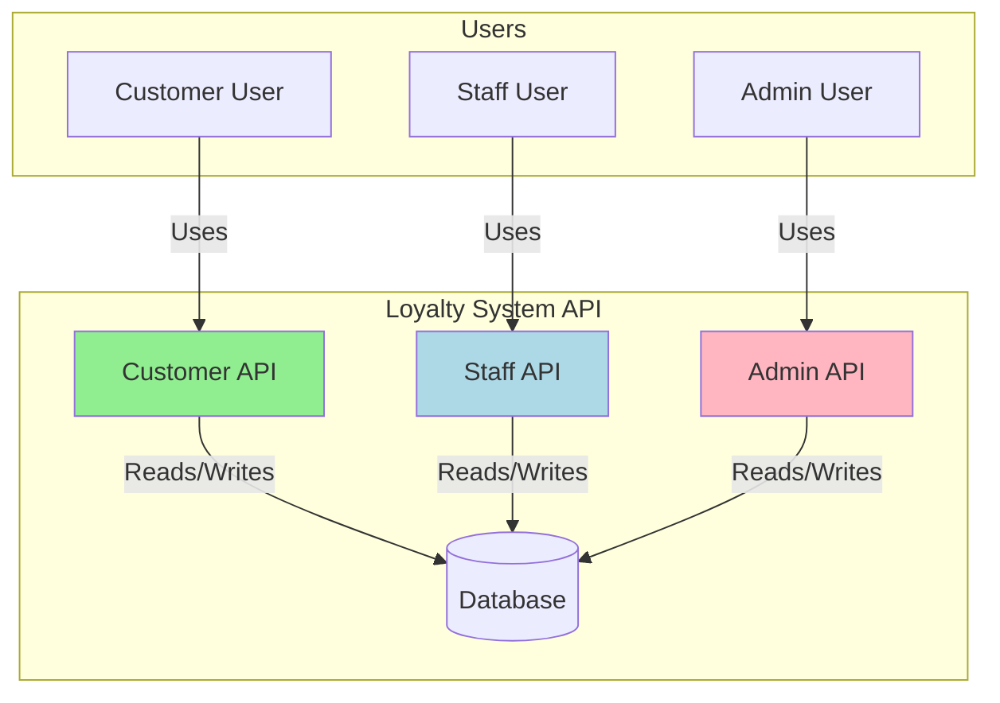
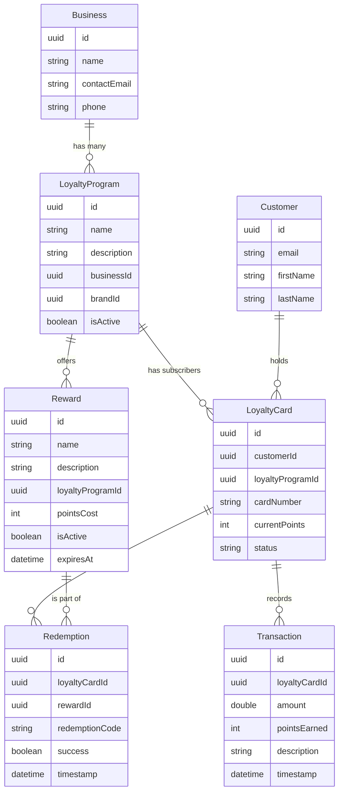
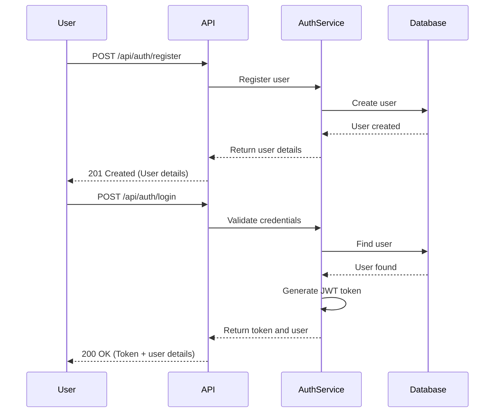
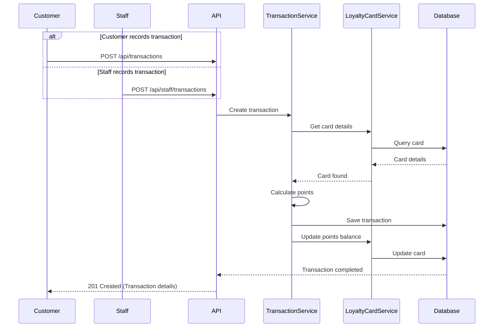
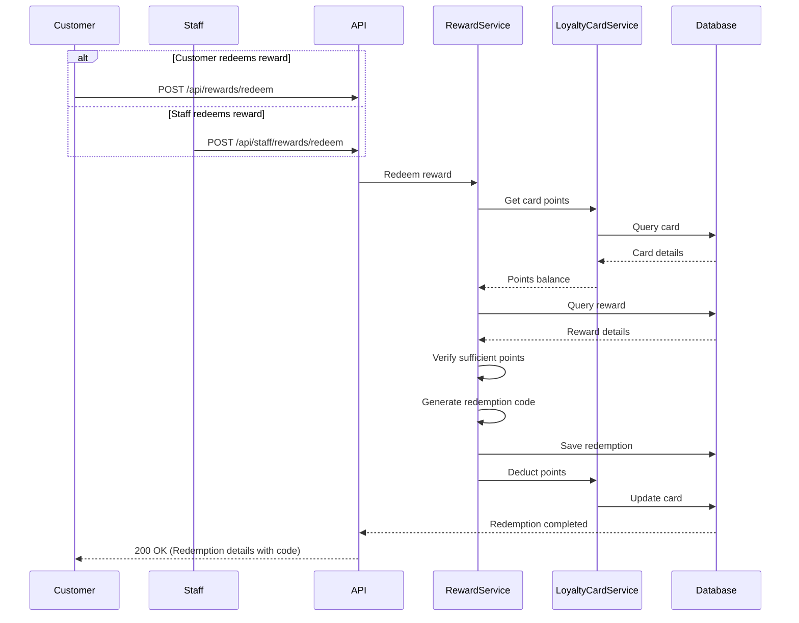

# Loyalty System API Diagrams

## High-Level Architecture



## Customer API Endpoints

```mermaid
classDiagram
    class CustomerAuthentication {
        POST /api/auth/register
        POST /api/auth/login
        GET /api/auth/loyalty-summary
    }
    
    class LoyaltyPrograms {
        GET /api/loyaltyPrograms
        GET /api/loyaltyPrograms/{id}
        GET /api/loyaltyPrograms/brand/{brandId}
        GET /api/loyaltyPrograms/nearby
        GET /api/loyaltyPrograms/search
    }
    
    class LoyaltyCards {
        POST /api/loyaltyCards
        GET /api/loyaltyCards/mine
        GET /api/loyaltyCards/{id}
        GET /api/loyaltyCards/{id}/transactions
        GET /api/loyaltyCards/{id}/qr-code
        GET /api/loyaltyCards/nearby-stores
    }
    
    class Rewards {
        GET /api/loyaltyPrograms/{id}/rewards
        GET /api/loyaltyPrograms/{id}/rewards/{rewardId}
        POST /api/rewards/redeem
    }
    
    class Transactions {
        POST /api/transactions
    }
    
    CustomerAuthentication -- LoyaltyPrograms : authenticated user accesses
    CustomerAuthentication -- LoyaltyCards : authenticated user accesses
    CustomerAuthentication -- Rewards : authenticated user accesses
    CustomerAuthentication -- Transactions : authenticated user accesses
    LoyaltyPrograms -- Rewards : program contains rewards
    LoyaltyCards -- Transactions : card has transactions
```

## Admin API Endpoints

```mermaid
classDiagram
    class AdminAuthentication {
        POST /api/admin/auth/login
    }
    
    class BusinessManagement {
        GET /api/admin/businesses
        POST /api/admin/businesses
    }
    
    class LoyaltyProgramManagement {
        GET /api/admin/loyalty-programs
        POST /api/admin/loyalty-programs
        GET /api/admin/loyalty-programs/{id}
        PUT /api/admin/loyalty-programs/{id}
        DELETE /api/admin/loyalty-programs/{id}
    }
    
    class RewardManagement {
        POST /api/admin/rewards
        PUT /api/admin/rewards/{id}
        DELETE /api/admin/rewards/{id}
    }
    
    class Analytics {
        GET /api/admin/analytics/dashboard
        GET /api/admin/analytics/customers
        GET /api/admin/analytics/transactions
    }
    
    AdminAuthentication -- BusinessManagement : authenticated admin accesses
    AdminAuthentication -- LoyaltyProgramManagement : authenticated admin accesses
    AdminAuthentication -- RewardManagement : authenticated admin accesses
    AdminAuthentication -- Analytics : authenticated admin accesses
    BusinessManagement -- LoyaltyProgramManagement : business contains programs
    LoyaltyProgramManagement -- RewardManagement : program contains rewards
```

## Staff API Endpoints

```mermaid
classDiagram
    class StaffAuthentication {
        POST /api/staff/auth/login
    }
    
    class CustomerManagement {
        GET /api/staff/customers/lookup
    }
    
    class TransactionProcessing {
        POST /api/staff/transactions
    }
    
    class RewardRedemption {
        POST /api/staff/rewards/redeem
        GET /api/staff/rewards/validate/{code}
    }
    
    StaffAuthentication -- CustomerManagement : authenticated staff accesses
    StaffAuthentication -- TransactionProcessing : authenticated staff accesses
    StaffAuthentication -- RewardRedemption : authenticated staff accesses
    CustomerManagement -- TransactionProcessing : for customer
    CustomerManagement -- RewardRedemption : for customer
```

## Data Models and Relationships



## Authentication Flow



## Transaction Flow



## Reward Redemption Flow

