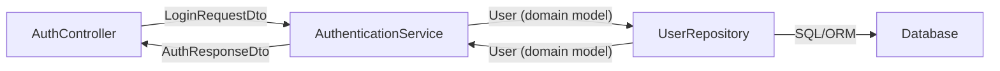
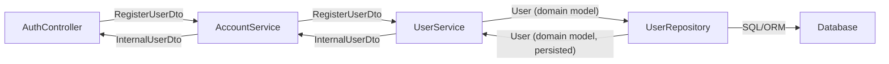
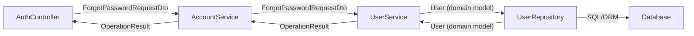
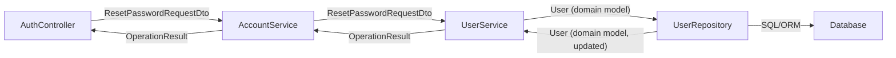
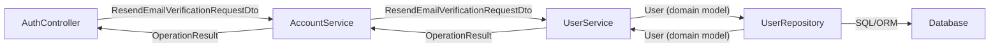
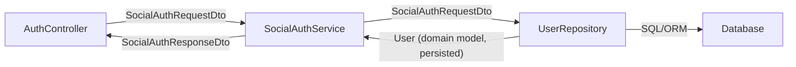

# Admin API - Authentication Flows

This document visualizes the data flow and mapping for all authentication-related endpoints in the Admin API, including the DTOs and domain models used at each layer.

---

## 1. Login

**Endpoint:** `POST /api/auth/login`

| Layer       | Input DTO/Model      | Output DTO/Model     | Mapping/Notes                                 |
|-------------|----------------------|----------------------|-----------------------------------------------|
| Controller  | LoginRequestDto      | AuthResponseDto      | Receives login request, returns auth response |
| Service     | LoginRequestDto      | User (domain)        | Validates credentials, fetches user           |
|             | User (domain)        | AuthResponseDto      | Maps user to auth response DTO                |
| Repository  | User (domain)        | User (domain)        | Fetches user by email/username                |



---

## 2. Register

**Endpoint:** `POST /api/auth/register`

| Layer       | Input DTO/Model        | Output DTO/Model         | Mapping/Notes                                 |
|-------------|------------------------|--------------------------|-----------------------------------------------|
| Controller  | RegisterUserDto        | InternalUserDto          | Receives registration request, returns user   |
| Service     | RegisterUserDto        | User (domain)            | Maps DTO to domain, handles business logic    |
|             | User (domain)          | InternalUserDto          | Maps domain to response DTO                   |
| Repository  | User (domain)          | User (domain, persisted) | Persists domain model, returns updated model  |



---

## 3. Forgot Password

**Endpoint:** `POST /api/auth/forgot-password`

| Layer       | Input DTO/Model            | Output DTO/Model     | Mapping/Notes                                 |
|-------------|----------------------------|----------------------|-----------------------------------------------|
| Controller  | ForgotPasswordRequestDto   | OperationResult      | Receives request, returns result              |
| Service     | ForgotPasswordRequestDto   | User (domain)        | Finds user, generates token                   |
|             | User (domain)              | OperationResult      | Sends email, returns result                   |
| Repository  | User (domain)              | User (domain)        | Fetches user by email/username                |



---

## 4. Reset Password

**Endpoint:** `POST /api/auth/reset-password`

| Layer       | Input DTO/Model            | Output DTO/Model     | Mapping/Notes                                 |
|-------------|----------------------------|----------------------|-----------------------------------------------|
| Controller  | ResetPasswordRequestDto    | OperationResult      | Receives request, returns result              |
| Service     | ResetPasswordRequestDto    | User (domain)        | Finds user, validates token, updates password  |
|             | User (domain)              | OperationResult      | Updates password, returns result              |
| Repository  | User (domain)              | User (domain)        | Updates password in DB                        |



---

## 5. Resend Email Verification

**Endpoint:** `POST /api/auth/resend-verification`

| Layer       | Input DTO/Model                  | Output DTO/Model     | Mapping/Notes                                 |
|-------------|----------------------------------|----------------------|-----------------------------------------------|
| Controller  | ResendEmailVerificationRequestDto| OperationResult      | Receives request, returns result              |
| Service     | ResendEmailVerificationRequestDto| User (domain)        | Finds user, generates token                   |
|             | User (domain)                    | OperationResult      | Sends email, returns result                   |
| Repository  | User (domain)                    | User (domain)        | Fetches user by email                         |



---

## 6. Social Login

**Endpoint:** `POST /api/auth/social-login`

| Layer       | Input DTO/Model         | Output DTO/Model         | Mapping/Notes                                 |
|-------------|-------------------------|--------------------------|-----------------------------------------------|
| Controller  | SocialAuthRequestDto    | SocialAuthResponseDto    | Receives request, returns response            |
| Service     | SocialAuthRequestDto    | User (domain)            | Validates token, fetches/creates user         |
|             | User (domain)           | SocialAuthResponseDto    | Maps domain to response DTO                   |
| Repository  | User (domain)           | User (domain, persisted) | Fetches or creates user                       |



---

## 7. All Authentication Flows (Individual Flows in One Diagram)

The following Mermaid diagram includes all authentication-related endpoint flows, each as a separate flow, using the same style as the individual diagrams above. Each flow is labeled and shows the DTOs/models at each step.

```mermaid
%% Login
flowchart LR
    A1[AuthController] -- LoginRequestDto --> B1[AuthenticationService]
    B1 -- User (domain model) --> C1[UserRepository]
    C1 -- User (domain model) --> B1
    B1 -- AuthResponseDto --> A1
    C1 -- SQL/ORM --> D1[Database]

%% Register
flowchart LR
    A2[AuthController] -- RegisterUserDto --> B2[AccountService]
    B2 -- RegisterUserDto --> C2[UserService]
    C2 -- User (domain model) --> D2[UserRepository]
    D2 -- User (domain model, persisted) --> C2
    C2 -- InternalUserDto --> B2
    B2 -- InternalUserDto --> A2
    D2 -- SQL/ORM --> E2[Database]

%% Forgot Password
flowchart LR
    A3[AuthController] -- ForgotPasswordRequestDto --> B3[AccountService]
    B3 -- ForgotPasswordRequestDto --> C3[UserService]
    C3 -- User (domain model) --> D3[UserRepository]
    D3 -- User (domain model) --> C3
    C3 -- OperationResult --> B3
    B3 -- OperationResult --> A3
    D3 -- SQL/ORM --> E3[Database]

%% Reset Password
flowchart LR
    A4[AuthController] -- ResetPasswordRequestDto --> B4[AccountService]
    B4 -- ResetPasswordRequestDto --> C4[UserService]
    C4 -- User (domain model) --> D4[UserRepository]
    D4 -- User (domain model, updated) --> C4
    C4 -- OperationResult --> B4
    B4 -- OperationResult --> A4
    D4 -- SQL/ORM --> E4[Database]

%% Resend Email Verification
flowchart LR
    A5[AuthController] -- ResendEmailVerificationRequestDto --> B5[AccountService]
    B5 -- ResendEmailVerificationRequestDto --> C5[UserService]
    C5 -- User (domain model) --> D5[UserRepository]
    D5 -- User (domain model) --> C5
    C5 -- OperationResult --> B5
    B5 -- OperationResult --> A5
    D5 -- SQL/ORM --> E5[Database]

%% Social Login
flowchart LR
    A6[AuthController] -- SocialAuthRequestDto --> B6[SocialAuthService]
    B6 -- SocialAuthRequestDto --> C6[UserRepository]
    C6 -- User (domain model, persisted) --> B6
    B6 -- SocialAuthResponseDto --> A6
    C6 -- SQL/ORM --> D6[Database]
``` 