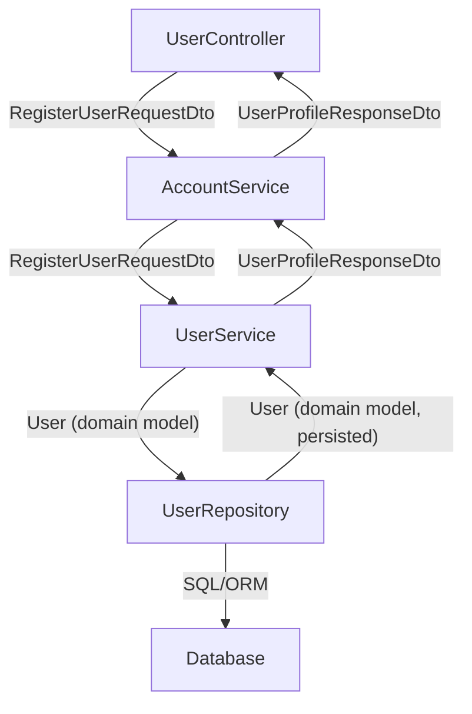

# DTO/Model Mapping Strategy Template

## Mapping Principles
- Map DTOs to domain models in the application/service layer.
- Never expose domain models directly to the API or client.
- Keep mapping logic centralized and testable (e.g., extension methods, static mappers, or mapping libraries).
- Explicitly map only the fields you want to expose or accept.
- Handle sensitive fields (e.g., PasswordHash) carefully—never map to DTOs returned to clients.

## Example Mapping Extensions
```csharp
public static class UserMappingExtensions
{
    public static UserDto ToDto(this User user) => new UserDto
    {
        Id = user.Id,
        FirstName = user.FirstName,
        LastName = user.LastName,
        UserName = user.UserName,
        Email = user.Email,
        // ...other safe fields...
        Roles = user.Roles.Select(r => r.Role.ToString()).ToList(),
        IsEmailConfirmed = user.IsEmailConfirmed
    };

    public static User ToDomain(this RegisterUserRequestDto dto) => new User(
        dto.FirstName,
        dto.LastName,
        dto.UserName,
        dto.Email,
        passwordHash: "", // Set after hashing
        customerId: null // Set if needed
    );
}
```

---

# Model Documentation Template

## {ModelName}

### Overview
- **Purpose:** Briefly describe what this model represents and its role in the system.
- **Layer:** (Domain Entity, DTO, Value Object, etc.)
- **Related Models:** List related models/entities/DTOs.

### Properties
| Name              | Type           | Description                                  | Required | Default | Notes/Validation                |
|-------------------|----------------|----------------------------------------------|----------|---------|---------------------------------|
| Id                | Guid           | Unique identifier                            | Yes      |         |                                 |
| FirstName         | string         | User's first name                            | Yes      |         | 2-100 chars                     |
| Email             | string         | User's email address                         | Yes      |         | Must be valid email             |
| PasswordHash      | string         | Hashed password (domain only)                | Yes      |         | Never exposed in DTO            |
| Roles             | List<string>   | User roles                                   | Yes      |         | Enum: Admin, User, etc.         |
| ...               | ...            | ...                                          | ...      | ...     | ...                             |

### Value Ranges & Validation
- **Email:** Must be a valid email address.
- **PasswordHash:** Never exposed in DTOs.
- **Roles:** Must be a valid role from the `RoleType` enum.

### Optional Fields
- List any fields that are optional, and what it means if they are null/missing.

### Usage Examples
```csharp
// Mapping from domain to DTO
var userDto = user.ToDto();

// Mapping from DTO to domain
var user = registerUserDto.ToDomain();
```

### Relationships
- **User** has a one-to-many relationship with **LoyaltyCard**.
- **CustomerId** links to **Customer** entity.

### Security Notes
- **PasswordHash**: Never expose in API responses or logs.
- **Sensitive fields**: Document which fields are sensitive and how they are handled.

### Version History
- v1.0: Initial version
- v1.1: Added IsEmailConfirmed

---

# Up-Front Model Design Checklist

- [ ] Identify core entities and value objects
- [ ] Define domain models first (focus on business rules and relationships)
- [ ] Define DTOs for API boundaries (input/output)
- [ ] Document each model using the template above
- [ ] Plan mapping logic and document mapping rules
- [ ] Review and iterate as features are implemented 

---

# Example: User Registration Endpoint Data Flow & Mapping

## Endpoint: POST /api/users/register

| Layer       | Input DTO/Model              | Output DTO/Model             | Mapping/Notes                                 |
|-------------|------------------------------|------------------------------|-----------------------------------------------|
| Controller  | RegisterUserRequestDto       | UserProfileResponseDto       | Receives request, returns response DTO        |
| Service     | RegisterUserRequestDto       | User (domain)                | Maps DTO to domain, handles business logic    |
|             | User (domain)                | UserProfileResponseDto       | Maps domain to response DTO                   |
| Repository  | User (domain)                | User (domain, persisted)     | Persists domain model, returns updated model  |

### Mermaid Diagram



--- 