# Loyalty System API Endpoints

## All Endpoints Overview

```mermaid
graph TD
    %% Main API Groups
    CustomerAPI[Customer API]
    AdminAPI[Admin API]
    StaffAPI[Staff API]
    
    %% Customer API Endpoints
    CustomerAPI --> CustomerAuth[Authentication]
    CustomerAPI --> CustomerLP[Loyalty Programs]
    CustomerAPI --> CustomerLC[Loyalty Cards]
    CustomerAPI --> CustomerRewards[Rewards]
    CustomerAPI --> CustomerTrans[Transactions]
    
    %% Admin API Endpoints
    AdminAPI --> AdminAuth[Authentication]
    AdminAPI --> AdminBusiness[Business Management]
    AdminAPI --> AdminLP[Loyalty Programs]
    AdminAPI --> AdminRewards[Rewards]
    AdminAPI --> AdminAnalytics[Analytics]
    
    %% Staff API Endpoints
    StaffAPI --> StaffAuth[Authentication]
    StaffAPI --> StaffCustomers[Customer Management]
    StaffAPI --> StaffTrans[Transactions]
    StaffAPI --> StaffRewards[Rewards]
    
    %% Styling
    style CustomerAPI fill:#90EE90
    style AdminAPI fill:#FFB6C1
    style StaffAPI fill:#ADD8E6
```



## Customer API Endpoints

```mermaid
graph TD
    %% Authentication Endpoints
    Auth[Customer Authentication]
    Auth --> AuthRegister[POST /api/auth/register]
    Auth --> AuthLogin[POST /api/auth/login]
    Auth --> AuthSummary[GET /api/auth/loyalty-summary]
    
    %% Loyalty Programs Endpoints
    LP[Loyalty Programs]
    LP --> LPAll[GET /api/loyaltyPrograms]
    LP --> LPById[GET /api/loyaltyPrograms/{id}]
    LP --> LPByBrand[GET /api/loyaltyPrograms/brand/{brandId}]
    LP --> LPNearby[GET /api/loyaltyPrograms/nearby]
    LP --> LPSearch[GET /api/loyaltyPrograms/search]
    
    %% Loyalty Cards Endpoints
    LC[Loyalty Cards]
    LC --> LCCreate[POST /api/loyaltyCards]
    LC --> LCMine[GET /api/loyaltyCards/mine]
    LC --> LCById[GET /api/loyaltyCards/{id}]
    LC --> LCTrans[GET /api/loyaltyCards/{id}/transactions]
    LC --> LCQRCode[GET /api/loyaltyCards/{id}/qr-code]
    LC --> LCNearbyStores[GET /api/loyaltyCards/nearby-stores]
    
    %% Rewards Endpoints
    Rewards[Rewards]
    Rewards --> RewardsByProg[GET /api/loyaltyPrograms/{id}/rewards]
    Rewards --> RewardById[GET /api/loyaltyPrograms/{id}/rewards/{rewardId}]
    Rewards --> RewardsRedeem[POST /api/rewards/redeem]
    
    %% Transactions Endpoints
    Trans[Transactions]
    Trans --> TransCreate[POST /api/transactions]
    
    %% Styling
    style Auth fill:#f9d77e
    style LP fill:#a8d0db
    style LC fill:#b8e0d2
    style Rewards fill:#c7ceea
    style Trans fill:#daeaf6
```

## Admin API Endpoints

```mermaid
graph TD
    %% Authentication Endpoints
    Auth[Admin Authentication]
    Auth --> AuthLogin[POST /api/admin/auth/login]
    
    %% Business Management Endpoints
    Business[Business Management]
    Business --> BusinessAll[GET /api/admin/businesses]
    Business --> BusinessCreate[POST /api/admin/businesses]
    
    %% Loyalty Programs Endpoints
    LP[Loyalty Programs]
    LP --> LPAll[GET /api/admin/loyalty-programs]
    LP --> LPCreate[POST /api/admin/loyalty-programs]
    LP --> LPById[GET /api/admin/loyalty-programs/{id}]
    LP --> LPUpdate[PUT /api/admin/loyalty-programs/{id}]
    LP --> LPDelete[DELETE /api/admin/loyalty-programs/{id}]
    
    %% Rewards Endpoints
    Rewards[Rewards]
    Rewards --> RewardsCreate[POST /api/admin/rewards]
    Rewards --> RewardsUpdate[PUT /api/admin/rewards/{id}]
    Rewards --> RewardsDelete[DELETE /api/admin/rewards/{id}]
    
    %% Analytics Endpoints
    Analytics[Analytics]
    Analytics --> AnalyticsDashboard[GET /api/admin/analytics/dashboard]
    Analytics --> AnalyticsCustomers[GET /api/admin/analytics/customers]
    Analytics --> AnalyticsTrans[GET /api/admin/analytics/transactions]
    
    %% Styling
    style Auth fill:#f9d77e
    style Business fill:#f7a399
    style LP fill:#a8d0db
    style Rewards fill:#c7ceea
    style Analytics fill:#d8bfd8
```

## Staff API Endpoints

```mermaid
graph TD
    %% Authentication Endpoints
    Auth[Staff Authentication]
    Auth --> AuthLogin[POST /api/staff/auth/login]
    
    %% Customer Management Endpoints
    Customer[Customer Management]
    Customer --> CustomerLookup[GET /api/staff/customers/lookup]
    
    %% Transactions Endpoints
    Trans[Transactions]
    Trans --> TransCreate[POST /api/staff/transactions]
    
    %% Rewards Endpoints
    Rewards[Rewards]
    Rewards --> RewardsRedeem[POST /api/staff/rewards/redeem]
    Rewards --> RewardsValidate[GET /api/staff/rewards/validate/{code}]
    
    %% Styling
    style Auth fill:#f9d77e
    style Customer fill:#f7a399
    style Trans fill:#daeaf6
    style Rewards fill:#c7ceea
```

## Complete Endpoint List

### Customer API
1. **Authentication**
   - `POST /api/auth/register` - Register a new customer account
   - `POST /api/auth/login` - Login to customer account
   - `GET /api/auth/loyalty-summary` - Get customer loyalty summary

2. **Loyalty Programs**
   - `GET /api/loyaltyPrograms` - Get available loyalty programs
   - `GET /api/loyaltyPrograms/{id}` - Get loyalty program by ID
   - `GET /api/loyaltyPrograms/brand/{brandId}` - Get loyalty programs by brand ID
   - `GET /api/loyaltyPrograms/nearby` - Get nearby loyalty programs
   - `GET /api/loyaltyPrograms/search` - Search loyalty programs

3. **Loyalty Cards**
   - `POST /api/loyaltyCards` - Enroll in a loyalty program
   - `GET /api/loyaltyCards/mine` - Get customer's loyalty cards
   - `GET /api/loyaltyCards/{id}` - Get loyalty card by ID
   - `GET /api/loyaltyCards/{id}/transactions` - Get transactions for a loyalty card
   - `GET /api/loyaltyCards/{id}/qr-code` - Get QR code for a loyalty card
   - `GET /api/loyaltyCards/nearby-stores` - Get nearby stores

4. **Rewards**
   - `GET /api/loyaltyPrograms/{id}/rewards` - Get rewards for a loyalty program
   - `GET /api/loyaltyPrograms/{id}/rewards/{rewardId}` - Get specific reward for a loyalty program
   - `POST /api/rewards/redeem` - Redeem a reward

5. **Transactions**
   - `POST /api/transactions` - Record a transaction

### Admin API
1. **Authentication**
   - `POST /api/admin/auth/login` - Login to admin account

2. **Business Management**
   - `GET /api/admin/businesses` - Get all businesses
   - `POST /api/admin/businesses` - Create a new business

3. **Loyalty Programs**
   - `GET /api/admin/loyalty-programs` - Get all loyalty programs
   - `POST /api/admin/loyalty-programs` - Create a new loyalty program
   - `GET /api/admin/loyalty-programs/{id}` - Get loyalty program by ID
   - `PUT /api/admin/loyalty-programs/{id}` - Update a loyalty program
   - `DELETE /api/admin/loyalty-programs/{id}` - Delete a loyalty program

4. **Rewards**
   - `POST /api/admin/rewards` - Create a new reward
   - `PUT /api/admin/rewards/{id}` - Update a reward
   - `DELETE /api/admin/rewards/{id}` - Delete a reward

5. **Analytics**
   - `GET /api/admin/analytics/dashboard` - Get dashboard analytics
   - `GET /api/admin/analytics/customers` - Get customer analytics
   - `GET /api/admin/analytics/transactions` - Get transaction analytics

### Staff API
1. **Authentication**
   - `POST /api/staff/auth/login` - Login to staff account

2. **Customer Management**
   - `GET /api/staff/customers/lookup` - Lookup a customer

3. **Transactions**
   - `POST /api/staff/transactions` - Record a transaction

4. **Rewards**
   - `POST /api/staff/rewards/redeem` - Redeem a reward
   - `GET /api/staff/rewards/validate/{code}` - Validate a redemption code 