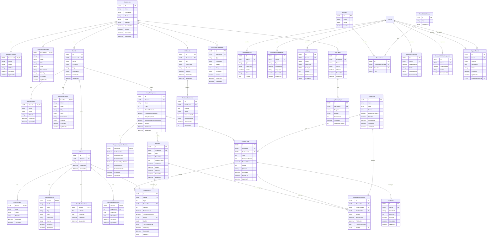

```mermaid
erDiagram
    %% Core Entities
    Businesses {
        UUID Id PK
        string Name
        string Description
        string TaxId
        string Logo
        string Website
        datetime FoundedDate
        boolean IsActive
        datetime CreatedAt
        datetime UpdatedAt
    }

    BusinessContacts {
        UUID BusinessId PK,FK
        string Email
        string Phone
        string Website
        datetime CreatedAt
        datetime UpdatedAt
    }

    BusinessAddresses {
        UUID BusinessId PK,FK
        string Line1
        string Line2
        string City
        string State
        string PostalCode
        string Country
        datetime CreatedAt
        datetime UpdatedAt
    }

    Brands {
        UUID Id PK
        UUID BusinessId FK
        string Name
        string Category
        string Logo
        string Description
        datetime CreatedAt
        datetime UpdatedAt
    }

    BrandContacts {
        UUID BrandId PK,FK
        string Email
        string Phone
        string Website
        datetime CreatedAt
        datetime UpdatedAt
    }

    BrandAddresses {
        UUID BrandId PK,FK
        string Line1
        string Line2
        string City
        string State
        string PostalCode
        string Country
        datetime CreatedAt
        datetime UpdatedAt
    }

    Stores {
        UUID Id PK
        UUID BrandId FK
        string Name
        datetime CreatedAt
        datetime UpdatedAt
    }

    StoreContacts {
        UUID StoreId PK,FK
        string Email
        string Phone
        string Website
        datetime CreatedAt
        datetime UpdatedAt
    }

    StoreAddresses {
        UUID StoreId PK,FK
        string Line1
        string Line2
        string City
        string State
        string PostalCode
        string Country
        datetime CreatedAt
        datetime UpdatedAt
    }

    StoreGeoLocations {
        UUID StoreId PK,FK
        float Latitude
        float Longitude
        datetime CreatedAt
        datetime UpdatedAt
    }

    StoreOperatingHours {
        UUID StoreId PK,FK
        int DayOfWeek PK
        time OpenTime
        time CloseTime
        datetime CreatedAt
        datetime UpdatedAt
    }

    %% Loyalty Program Entities
    LoyaltyPrograms {
        UUID Id PK
        UUID BrandId FK
        string Name
        int Type
        int StampThreshold
        decimal PointsConversionRate
        int DailyStampLimit
        decimal MinimumTransactionAmount
        boolean IsActive
        datetime CreatedAt
        datetime UpdatedAt
    }

    ProgramExpirationPolicies {
        UUID ProgramId PK,FK
        boolean HasExpiration
        int ExpirationType
        int ExpirationValue
        boolean ExpiresOnSpecificDate
        int ExpirationDay
        int ExpirationMonth
        datetime CreatedAt
        datetime UpdatedAt
    }

    Rewards {
        UUID Id PK
        UUID ProgramId FK
        string Title
        string Description
        int RequiredValue
        datetime ValidFrom
        datetime ValidTo
        boolean IsActive
        datetime CreatedAt
        datetime UpdatedAt
    }

    %% Customer Entities
    Customers {
        UUID Id PK
        string Name
        string Email
        string Phone
        boolean MarketingConsent
        datetime JoinedAt
        datetime LastLoginAt
        datetime CreatedAt
        datetime UpdatedAt
    }

    LoyaltyCards {
        UUID Id PK
        UUID ProgramId FK
        UUID CustomerId FK
        int Type
        int StampsCollected
        decimal PointsBalance
        int Status
        string QrCode
        datetime CreatedAt
        datetime ExpiresAt
        datetime UpdatedAt
    }

    %% Transaction Entities
    Transactions {
        UUID Id PK
        UUID CardId FK
        int Type
        UUID RewardId FK
        int Quantity
        decimal PointsAmount
        decimal TransactionAmount
        UUID StoreId FK
        UUID StaffId
        string PosTransactionId
        datetime Timestamp
        datetime CreatedAt
        string Metadata
    }

    CardLinks {
        UUID Id PK
        UUID CardId FK
        string CardHash
        int LinkType
        boolean IsActive
        datetime CreatedAt
        datetime UpdatedAt
    }

    %% Extensibility & Integrations
    Webhooks {
        UUID Id PK
        UUID BusinessId FK
        string Url
        string EventType
        string Secret
        boolean IsActive
        datetime CreatedAt
        datetime UpdatedAt
    }
    WebhookDeliveries {
        UUID Id PK
        UUID WebhookId FK
        json Payload
        string Status
        int ResponseCode
        string ResponseBody
        datetime AttemptedAt
        int RetryCount
    }

    %% Notifications
    NotificationTemplates {
        UUID Id PK
        UUID BusinessId FK
        string Type
        string EventType
        string Subject
        text Body
        string Language
        boolean IsActive
        datetime CreatedAt
        datetime UpdatedAt
    }
    NotificationLogs {
        UUID Id PK
        UUID UserId FK
        string Type
        string EventType
        datetime SentAt
        string Status
        json Payload
    }
    NotificationPreferences {
        UUID Id PK
        UUID UserId FK
        string Type
        boolean Subscribed
        string Language
        datetime CreatedAt
        datetime UpdatedAt
    }

    %% Audit & API Usage
    AuditLogs {
        UUID Id PK
        UUID UserId FK
        string Action
        string EntityType
        UUID EntityId
        json Details
        datetime PerformedAt
        string IPAddress
    }
    ApiClients {
        UUID Id PK
        UUID BusinessId FK
        string Name
        string ApiKey
        boolean IsActive
        datetime CreatedAt
        datetime UpdatedAt
    }
    ApiUsageLogs {
        UUID Id PK
        UUID ApiClientId FK
        string Endpoint
        string Method
        int StatusCode
        datetime RequestAt
        int ResponseTimeMs
    }

    %% Localization
    Locales {
        UUID Id PK
        string Code
        string Name
        boolean IsActive
    }
    TranslatableStrings {
        UUID Id PK
        string Key
        string DefaultText
    }
    Translations {
        UUID Id PK
        UUID TranslatableStringId FK
        UUID LocaleId FK
        string Text
    }

    %% Privacy/Compliance
    DataExportRequests {
        UUID Id PK
        UUID UserId FK
        datetime RequestedAt
        string Status
        string DownloadUrl
        datetime CompletedAt
    }
    AccountDeletionRequests {
        UUID Id PK
        UUID UserId FK
        datetime RequestedAt
        string Status
        datetime CompletedAt
    }

    %% Reward Fulfillment
    RewardRedemptions {
        UUID Id PK
        UUID RewardId FK
        UUID LoyaltyCardId FK
        UUID CustomerId FK
        string Status
        datetime RequestedAt
        datetime FulfilledAt
        json FulfillmentDetails
        UUID StaffId FK
    }

    %% Support/Escalation
    SupportTickets {
        UUID Id PK
        UUID UserId FK
        string Subject
        text Description
        string Status
        datetime CreatedAt
        datetime UpdatedAt
        UUID AssignedToStaffId FK
    }

    %% Relationship Definitions
    Businesses ||--|| BusinessContacts : "has"
    Businesses ||--|| BusinessAddresses : "has"
    Businesses ||--|{ Brands : "owns"
    
    Brands ||--|| BrandContacts : "has"
    Brands ||--|| BrandAddresses : "has"
    Brands ||--|{ Stores : "owns"
    Brands ||--|{ LoyaltyPrograms : "offers"
    
    Stores ||--|| StoreContacts : "has"
    Stores ||--|| StoreAddresses : "has"
    Stores ||--|| StoreGeoLocations : "has"
    Stores ||--|{ StoreOperatingHours : "has"
    
    LoyaltyPrograms ||--|| ProgramExpirationPolicies : "has"
    LoyaltyPrograms ||--|{ Rewards : "includes"
    LoyaltyPrograms ||--|{ LoyaltyCards : "issues"
    
    Customers ||--|{ LoyaltyCards : "holds"
    
    LoyaltyCards ||--|{ Transactions : "records"
    LoyaltyCards ||--|{ CardLinks : "linked_to"
    
    Stores ||--|{ Transactions : "processes"
    Rewards }|--|{ Transactions : "redeemed_in"

    %% New Relationships
    Businesses ||--|{ Webhooks : "has"
    Webhooks ||--|{ WebhookDeliveries : "delivers"
    Businesses ||--|{ NotificationTemplates : "has"
    Users ||--|{ NotificationLogs : "receives"
    Users ||--|{ NotificationPreferences : "sets"
    Users ||--|{ AuditLogs : "performs"
    Businesses ||--|{ ApiClients : "has"
    ApiClients ||--|{ ApiUsageLogs : "logs"
    Locales ||--|{ Translations : "provides"
    TranslatableStrings ||--|{ Translations : "has"
    Users ||--|{ DataExportRequests : "requests"
    Users ||--|{ AccountDeletionRequests : "requests"
    Rewards ||--|{ RewardRedemptions : "redeemed_by"
    LoyaltyCards ||--|{ RewardRedemptions : "used_for"
    Customers ||--|{ RewardRedemptions : "redeems"
    Users ||--|{ SupportTickets : "creates"
    Users ||--|{ SupportTickets : "assigned"
``` 