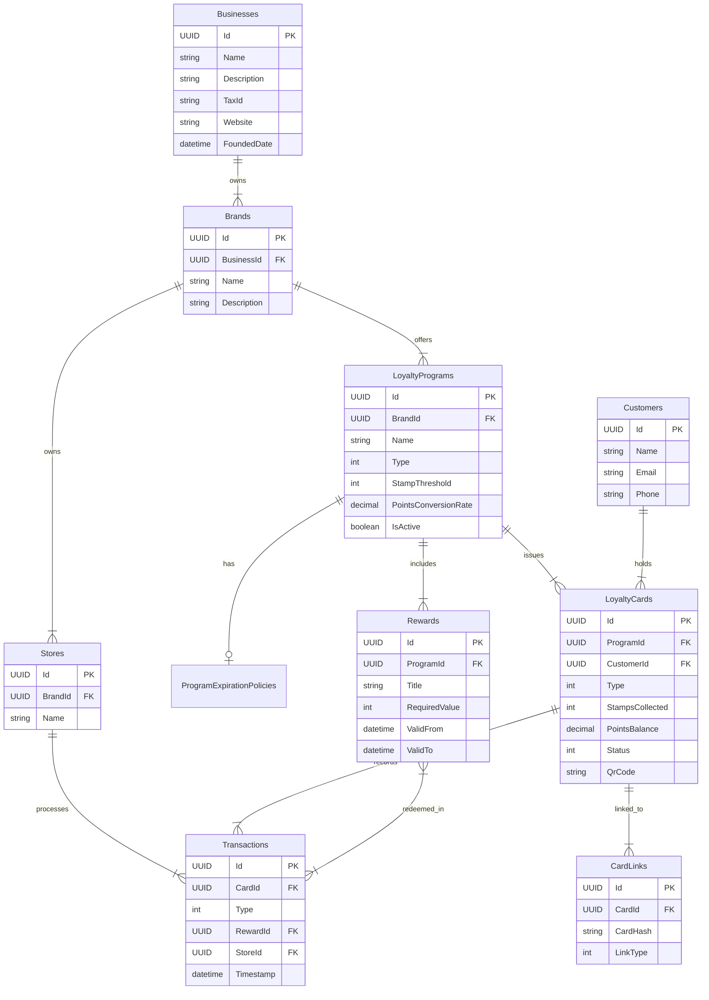

```mermaid
erDiagram
    Businesses ||--|{ Brands : owns
    Brands ||--|{ Stores : owns
    Brands ||--|{ LoyaltyPrograms : offers
    Stores ||--|{ Transactions : processes
    
    LoyaltyPrograms ||--o| ProgramExpirationPolicies : has
    LoyaltyPrograms ||--|{ Rewards : includes
    LoyaltyPrograms ||--|{ LoyaltyCards : issues
    
    Customers ||--|{ LoyaltyCards : holds
    
    LoyaltyCards ||--|{ Transactions : records
    LoyaltyCards ||--|{ CardLinks : linked_to
    
    Rewards }|--|{ Transactions : redeemed_in

    Businesses {
        UUID Id PK
        string Name
        string Description
        string TaxId
        string Website
        datetime FoundedDate
    }
    
    Brands {
        UUID Id PK
        UUID BusinessId FK
        string Name
        string Description
    }
    
    Stores {
        UUID Id PK
        UUID BrandId FK
        string Name
    }
    
    Customers {
        UUID Id PK
        string Name
        string Email
        string Phone
    }
    
    LoyaltyPrograms {
        UUID Id PK
        UUID BrandId FK
        string Name
        int Type
        int StampThreshold
        decimal PointsConversionRate
        boolean IsActive
    }
    
    Rewards {
        UUID Id PK
        UUID ProgramId FK
        string Title
        int RequiredValue
        datetime ValidFrom
        datetime ValidTo
    }
    
    LoyaltyCards {
        UUID Id PK
        UUID ProgramId FK
        UUID CustomerId FK
        int Type
        int StampsCollected
        decimal PointsBalance
        int Status
        string QrCode
    }
    
    Transactions {
        UUID Id PK
        UUID CardId FK
        int Type
        UUID RewardId FK
        UUID StoreId FK
        datetime Timestamp
    }
    
    CardLinks {
        UUID Id PK
        UUID CardId FK
        string CardHash
        int LinkType
    }
``` 