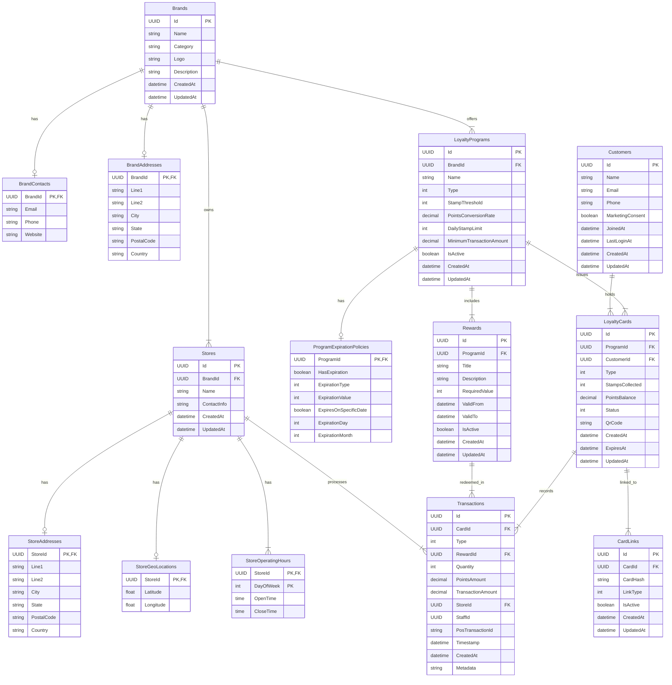

```mermaid
erDiagram
    Brands ||--o| BrandContacts : has
    Brands ||--o| BrandAddresses : has
    Brands ||--|{ Stores : owns
    Stores ||--o| StoreAddresses : has
    Stores ||--o| StoreGeoLocations : has
    Stores ||--|{ StoreOperatingHours : has
    Brands ||--|{ LoyaltyPrograms : offers
    LoyaltyPrograms ||--o| ProgramExpirationPolicies : has
    LoyaltyPrograms ||--|{ Rewards : includes
    LoyaltyPrograms ||--|{ LoyaltyCards : issues
    Customers ||--|{ LoyaltyCards : holds
    LoyaltyCards ||--|{ Transactions : records
    Rewards ||--|{ Transactions : redeemed_in
    Stores ||--|{ Transactions : processes
    LoyaltyCards ||--|{ CardLinks : linked_to

    Brands {
        UUID Id PK
        string Name
        string Category
        string Logo
        string Description
        datetime CreatedAt
        datetime UpdatedAt
    }

    BrandContacts {
        UUID BrandId PK,FK
        string Email
        string Phone
        string Website
    }

    BrandAddresses {
        UUID BrandId PK,FK
        string Line1
        string Line2
        string City
        string State
        string PostalCode
        string Country
    }

    Stores {
        UUID Id PK
        UUID BrandId FK
        string Name
        string ContactInfo
        datetime CreatedAt
        datetime UpdatedAt
    }

    StoreAddresses {
        UUID StoreId PK,FK
        string Line1
        string Line2
        string City
        string State
        string PostalCode
        string Country
    }

    StoreGeoLocations {
        UUID StoreId PK,FK
        float Latitude
        float Longitude
    }

    StoreOperatingHours {
        UUID StoreId PK,FK
        int DayOfWeek PK
        time OpenTime
        time CloseTime
    }

    Customers {
        UUID Id PK
        string Name
        string Email
        string Phone
        boolean MarketingConsent
        datetime JoinedAt
        datetime LastLoginAt
        datetime CreatedAt
        datetime UpdatedAt
    }

    LoyaltyPrograms {
        UUID Id PK
        UUID BrandId FK
        string Name
        int Type
        int StampThreshold
        decimal PointsConversionRate
        int DailyStampLimit
        decimal MinimumTransactionAmount
        boolean IsActive
        datetime CreatedAt
        datetime UpdatedAt
    }

    ProgramExpirationPolicies {
        UUID ProgramId PK,FK
        boolean HasExpiration
        int ExpirationType
        int ExpirationValue
        boolean ExpiresOnSpecificDate
        int ExpirationDay
        int ExpirationMonth
    }

    Rewards {
        UUID Id PK
        UUID ProgramId FK
        string Title
        string Description
        int RequiredValue
        datetime ValidFrom
        datetime ValidTo
        boolean IsActive
        datetime CreatedAt
        datetime UpdatedAt
    }

    LoyaltyCards {
        UUID Id PK
        UUID ProgramId FK
        UUID CustomerId FK
        int Type
        int StampsCollected
        decimal PointsBalance
        int Status
        string QrCode
        datetime CreatedAt
        datetime ExpiresAt
        datetime UpdatedAt
    }

    Transactions {
        UUID Id PK
        UUID CardId FK
        int Type
        UUID RewardId FK
        int Quantity
        decimal PointsAmount
        decimal TransactionAmount
        UUID StoreId FK
        UUID StaffId
        string PosTransactionId
        datetime Timestamp
        datetime CreatedAt
        string Metadata
    }

    CardLinks {
        UUID Id PK
        UUID CardId FK
        string CardHash
        int LinkType
        boolean IsActive
        datetime CreatedAt
        datetime UpdatedAt
    }
``` 